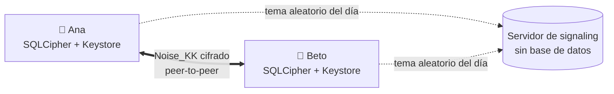
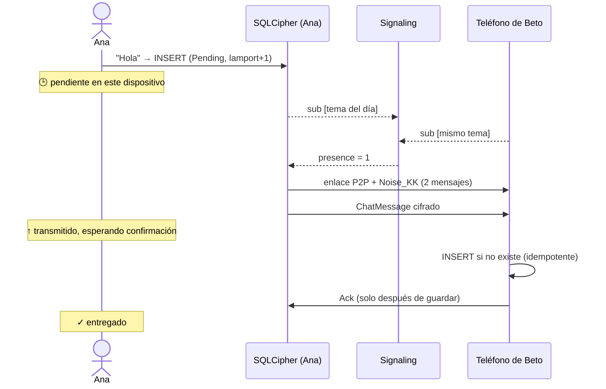
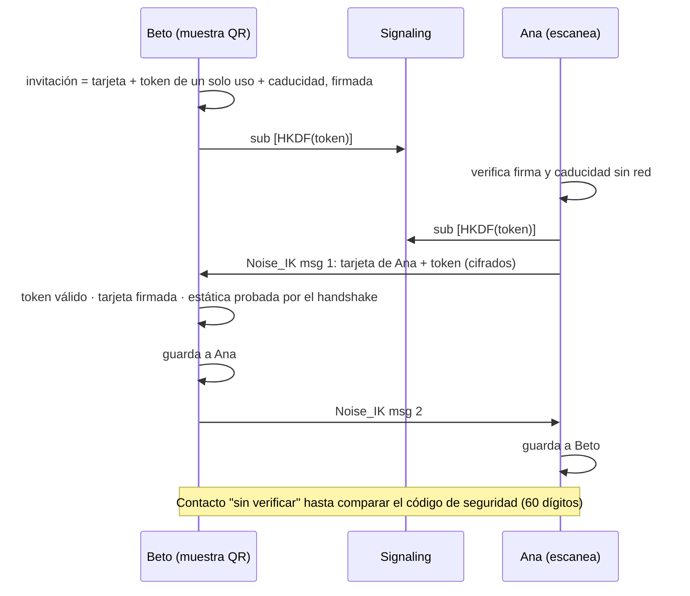
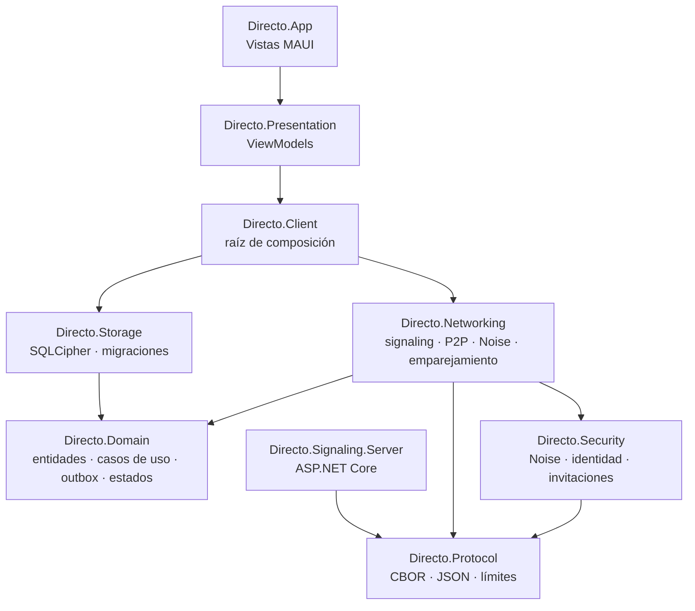

<p align="center">
  
</p>

<h1 align="center">Directo</h1>

<p align="center">
  <b>Mensajería privada, local-first, cifrada de extremo a extremo y peer-to-peer.</b><br>
  Sin cuentas, sin teléfono, sin email. Sin servidores que guarden tus conversaciones.
</p>

<p align="center">
  <a href="https://fsoftt.github.io/Directo/"><b>📖 Sitio del proyecto</b></a> ·
  <a href="docs/architecture.md">Arquitectura</a> ·
  <a href="docs/protocol/spec.md">Protocolo</a> ·
  <a href="docs/threat-model.md">Modelo de amenazas</a> ·
  <a href="docs/adr/README.md">Decisiones</a> ·
  <a href="CONTRIBUTING.md">Contribuir</a>
</p>

<p align="center">
  <a href="https://github.com/fsoftt/Directo/actions/workflows/ci.yml"></a>
  <a href="https://fsoftt.github.io/Directo/"></a>
  
  
  <a href="LICENSE"></a>
</p>

> [!WARNING]
> **Pre-alfa y sin auditar.** No uses Directo para comunicaciones sensibles hasta que exista una
> auditoría de seguridad independiente. Consulta el [modelo de amenazas](docs/threat-model.md).

---

## Contenido

- [Qué es](#qué-es)
- [Cómo funciona, en una imagen](#cómo-funciona-en-una-imagen)
- [Las reglas del juego](#las-reglas-del-juego)
- [La vida de un mensaje](#la-vida-de-un-mensaje)
- [Emparejamiento por QR](#emparejamiento-por-qr)
- [Arquitectura](#arquitectura)
- [Técnicas y dónde están en el código](#técnicas-y-dónde-están-en-el-código)
- [Seguridad y privacidad](#seguridad-y-privacidad)
- [Pruebas y CI](#pruebas-y-ci)
- [Ejecutarlo](#ejecutarlo)
- [Estructura del repositorio](#estructura-del-repositorio)
- [Estado y hoja de ruta](#estado-y-hoja-de-ruta)
- [Licencia](#licencia)

---

## Qué es

Directo es una aplicación de mensajería con tres propiedades que normalmente no van juntas:

1. **Local-first.** Tus conversaciones viven en tus dispositivos, en una base de datos cifrada. No hay copia en ningún servidor.
2. **Cifrado de extremo a extremo.** Solo los dos teléfonos de la conversación pueden leer los mensajes.
3. **Peer-to-peer.** Los mensajes viajan directamente de teléfono a teléfono; el servidor solo ayuda a que se encuentren.

> **Principio rector:** si una funcionalidad puede hacerse de forma segura en el dispositivo,
> necesita una buena razón para ir al servidor.

| Mensajería habitual | Directo |
|---|---|
| Te registras con tu número o email | Tu identidad es un par de claves generado en tu teléfono |
| El servidor guarda los mensajes hasta que los recibes | No hay buzón: el mensaje espera **en tu teléfono** |
| El servidor sabe quién es contacto de quién | Los contactos solo existen en los dos teléfonos |
| Añades contactos por su número | Os emparejáis **en persona** escaneando un QR |

## Cómo funciona, en una imagen



- Cada teléfono genera su **identidad** (claves Ed25519 y X25519) y la guarda en el **Android Keystore**.
- Dos personas se **emparejan escaneando un QR** firmado, de un solo uso.
- Cada pareja deriva un **tema de encuentro** que solo ella puede calcular y que cambia cada día. El
  servidor de signaling solo ve "dos conexiones en un tema aleatorio".
- Cuando ambos están online, abren una conexión directa y un **handshake Noise** nuevo, con *forward secrecy*.
- Los mensajes se guardan primero en un **outbox local** (SQLCipher) y se marcan como entregados solo
  cuando el otro confirma que los **guardó**.

## Las reglas del juego

Decisiones de producto explícitas, no letra pequeña:

| Regla | Consecuencia |
|---|---|
| Solo se entrega si **ambos estáis online a la vez** | Si escribes y cierras la app antes de que el otro se conecte, el mensaje espera en tu teléfono (🕒). |
| Conexión directa | **Tu contacto ve tu IP pública** mientras habláis. |
| Sin TURN en el MVP | En algunas redes (CGNAT estricto, redes corporativas) no habrá ruta directa y los mensajes seguirán pendientes. |
| Sin recuperación | Perder el teléfono es perder identidad, contactos e historial. |
| "Borrar" es borrar en tu teléfono | Nadie puede garantizar el borrado en el teléfono del otro. |

## La vida de un mensaje



| Si… | Entonces… |
|---|---|
| se pierde el ACK | se reenvía con backoff exponencial y jitter; el receptor no lo duplica y vuelve a confirmar |
| se corta la red | la sesión termina, se reconecta con backoff y se reenvía lo no confirmado |
| se cierra la app | el mensaje sigue en la base y se reenvía al volver |
| llegan miles de mensajes | el receptor aplica contrapresión: 20/s tras una ráfaga de 200 |
| alguien altera un byte | ChaCha20-Poly1305 lo detecta y la sesión se cierra |
| los relojes difieren | el orden lo dan los relojes de Lamport, no la hora |

## Emparejamiento por QR



El QR solo contiene **claves públicas** y un token aleatorio que caduca a los 10 minutos.

## Arquitectura

**Clean Architecture** con **MVVM**: las dependencias apuntan hacia el dominio, y el dominio no
conoce SQLite, Noise, WebSockets ni MAUI.



El transporte entre teléfonos es intercambiable (`IPeerLink`: fiable, ordenado, por mensajes). La
confidencialidad la pone Noise por encima, así que ningún transporte necesita ser de confianza:

| Transporte | Uso |
|---|---|
| WebRTC DataChannel (binding de `stream-webrtc-android`) | Producción, fase 4 |
| `InMemoryPeerLinkNetwork` | Tests: simula NAT inalcanzable y caídas |
| `DevRelayPeerLinkFactory` | Solo compilaciones Debug: canal cifrado por el relay del servidor |
| `UnavailablePeerLinkFactory` | Release hasta la fase 4 |

Más detalle en [`docs/architecture.md`](docs/architecture.md) y en el
[sitio](https://fsoftt.github.io/Directo/guide/architecture).

## Técnicas y dónde están en el código

| Técnica | Para qué | Dónde |
|---|---|---|
| **Noise_KK / Noise_IK** (25519, ChaChaPoly, SHA-256) | Autenticación mutua y claves nuevas por conexión (*forward secrecy*) | [`Security/Noise`](src/Directo.Security/Noise) · [`SecureHandshake.cs`](src/Directo.Networking/Secure/SecureHandshake.cs) |
| **Vectores de prueba independientes** | Nuestro Noise produce los mismos bytes que `noiseprotocol` (Python) | [`NoiseVectorTests.cs`](tests/Directo.Security.Tests/NoiseVectorTests.cs) |
| **Ed25519 / X25519** | Firmar tarjetas e invitaciones; acordar secretos | [`Curve25519.cs`](src/Directo.Security/Primitives/Curve25519.cs) · [`LocalIdentityKeys.cs`](src/Directo.Security/Identity/LocalIdentityKeys.cs) |
| **ChaCha20-Poly1305** con nonces de contador | Cifrado autenticado; detecta manipulación, replay y reordenamiento | [`ChaChaPoly.cs`](src/Directo.Security/Primitives/ChaChaPoly.cs) · [`CipherState.cs`](src/Directo.Security/Noise/CipherState.cs) |
| **HKDF** y temas de encuentro rotativos | Presencia sin revelar identidades | [`Rendezvous.cs`](src/Directo.Security/Identity/Rendezvous.cs) |
| **Invitaciones firmadas de un solo uso** | Emparejamiento por QR sin secretos en el código | [`InviteService.cs`](src/Directo.Security/Identity/InviteService.cs) · [`PairingService.cs`](src/Directo.Networking/Pairing/PairingService.cs) |
| **Código de seguridad** (estilo Signal) | Detectar a un impostor | [`SafetyNumber.cs`](src/Directo.Security/Identity/SafetyNumber.cs) |
| **CBOR estricto** con límites previos | Formato de cable compacto, evolutivo y resistente a entradas hostiles | [`Protocol/Frames`](src/Directo.Protocol/Frames) · [`CborMap.cs`](src/Directo.Protocol/Serialization/CborMap.cs) |
| **Outbox transaccional** | Ningún mensaje se pierde aunque la app muera | [`SendMessage.cs`](src/Directo.Domain/UseCases/SendMessage.cs) |
| **ACK tras persistir + recepción idempotente** | Ni pérdidas ni duplicados | [`ConversationSyncSession.cs`](src/Directo.Domain/Delivery/ConversationSyncSession.cs) · [`SqliteMessageRepository.cs`](src/Directo.Storage/Repositories/SqliteMessageRepository.cs) |
| **Backoff exponencial con jitter** | Reintentos sin saturar | [`Backoff.cs`](src/Directo.Domain/Common/Backoff.cs) |
| **Relojes de Lamport** | Mismo orden en ambos teléfonos, inmune al desfase de relojes | [`MessageRules.cs`](src/Directo.Domain/Model/MessageRules.cs) |
| **Máquina de estados explícita** | Ciclo de vida de la conexión sin estados imposibles | [`PeerConnectionStateMachine.cs`](src/Directo.Domain/Connections/PeerConnectionStateMachine.cs) |
| **Token bucket y contrapresión** | Frenar a un emisor rápido sin perder mensajes | [`TokenBucket.cs`](src/Directo.Domain/Common/TokenBucket.cs) |
| **SQLCipher + Keystore** | Base cifrada; la clave nunca está junto al fichero | [`SqliteDatabase.cs`](src/Directo.Storage/Database/SqliteDatabase.cs) · [`MauiSecretStore.cs`](src/Directo.App/Services/MauiSecretStore.cs) |
| **Migraciones versionadas** | Evolucionar el esquema sin perder datos | [`Migrations.cs`](src/Directo.Storage/Database/Migrations.cs) |
| **Límites anti-abuso** en el servidor | Temas, miembros, conexiones por IP, ritmo, colas acotadas | [`SignalingSession.cs`](src/Directo.Signaling.Server/SignalingSession.cs) |
| **Clean Architecture + MVVM** | Dominio sin dependencias; ViewModels testeables en cualquier SO | [`Directo.Domain`](src/Directo.Domain) · [`Directo.Presentation`](src/Directo.Presentation) |

Cada técnica tiene una página explicativa en [el sitio](https://fsoftt.github.io/Directo/concepts/).

## Seguridad y privacidad

| | Contenido | Contactos | Quién habla con quién | Tu IP |
|---|---|---|---|---|
| **Servidor de signaling** | ❌ | ❌ | Solo "dos conexiones comparten un tema aleatorio hoy" | ✅ |
| **Red o Wi-Fi hostil** | ❌ | ❌ | Tráfico entre dos IPs | ✅ |
| **Tu contacto** | ✅ | — | — | ✅ |
| **Ladrón con el teléfono bloqueado** | ❌ | ❌ | ❌ | — |
| **Malware en tu teléfono desbloqueado** | ✅ | ✅ | ✅ | ✅ |

- **Nunca** se registran mensajes, claves, tokens, invitaciones, temas ni IPs.
- Sin SDKs de analítica, publicidad ni crash reporting. Copias de seguridad de Android desactivadas.
- Un test graba **todo** el tráfico del servidor y comprueba que no contiene contenido, nombres ni claves de identidad.
- Vulnerabilidades: ver [`SECURITY.md`](SECURITY.md).

## Pruebas y CI

121 tests automatizados:

| Proyecto | Cubre |
|---|---|
| `Directo.Protocol.Tests` | Formatos de cable, compatibilidad hacia delante, límites, **fuzzing** (20 000 entradas) |
| `Directo.Security.Tests` | **Vectores Noise independientes**, manipulación, replay, invitaciones, código de seguridad, temas |
| `Directo.Core.Tests` | SQLCipher real (sin texto plano en disco), repositorios, Lamport, máquina de estados, entrega con fallos inyectados |
| `Directo.IntegrationTests` | **Servidor real en proceso + dos dispositivos completos**: emparejamiento, offline, emisor offline, caídas de red, peer inalcanzable, bloqueo, reinicios, el servidor no ve contenido, ViewModels |

La CI de GitHub Actions ejecuta formato, compilación Release con avisos como errores, pruebas con
cobertura, comprobación de dependencias vulnerables, compilación Android con APK de depuración,
imagen Docker del servidor y despliegue de este sitio en GitHub Pages.

## Ejecutarlo

Requisitos: [.NET SDK 10](https://dotnet.microsoft.com/download). Para la app: `dotnet workload install maui-android` y el SDK de Android.

```bash
# Pruebas (la solución no incluye la app MAUI, compila en cualquier SO)
dotnet test Directo.slnx

# Servidor de signaling
dotnet run --project src/Directo.Signaling.Server --urls http://0.0.0.0:8080
# o
docker build -f src/Directo.Signaling.Server/Dockerfile -t directo-signaling .
docker run -p 8080:8080 directo-signaling

# App Android (Debug: incluye el transporte de desarrollo)
dotnet build src/Directo.App -f net10.0-android -t:Run
```

El emulador de Android apunta por defecto a `ws://10.0.2.2:8080/ws`; en teléfonos reales cambia el
servidor en **Ajustes**. En producción el servidor va detrás de un proxy TLS (Release exige `wss://`);
activa `ASPNETCORE_FORWARDEDHEADERS_ENABLED=true` si el proxy reenvía la IP del cliente.

Sitio de documentación en local: `cd website && npm ci && npm run dev`.

## Estructura del repositorio

```text
src/
  Directo.Domain/            Entidades, casos de uso, entrega, máquina de estados, puertos
  Directo.Protocol/          CBOR, JSON de signaling, límites
  Directo.Security/          Noise, identidad, invitaciones, código de seguridad, temas
  Directo.Storage/           SQLCipher, migraciones, repositorios
  Directo.Networking/        Cliente de signaling, transportes, sesión Noise, conexiones, emparejamiento
  Directo.Client/            DirectoClient (raíz de composición)
  Directo.Presentation/      ViewModels MVVM
  Directo.App/               App .NET MAUI (Android)
  Directo.Signaling.Server/  Servidor ASP.NET Core
tests/                       Unitarios, vectores, integración
docs/                        Arquitectura, protocolo, amenazas, ADRs, documento original
website/                     Sitio VitePress publicado en GitHub Pages
```

## Estado y hoja de ruta

| Fase | Estado |
|---|---|
| 1. Identidad, Keystore, SQLCipher, dominio, migraciones | ✅ |
| 2. Emparejamiento QR y código de seguridad | ✅ |
| 3. Signaling: presencia, temas rotativos, reconexión, límites | ✅ |
| 4. P2P real con WebRTC DataChannel | ⏳ siguiente |
| 5. Mensajes E2EE, outbox, ACK, idempotencia, Lamport, contrapresión | ✅ (sobre transporte simulado y relay de desarrollo) |
| 6. Robustez en dispositivos reales | ⏳ |
| 7. Adjuntos | ⏳ |
| Auditoría de seguridad independiente | ⏳ antes de cualquier uso real |

Fuera del MVP, a propósito: grupos, llamadas, backups en la nube, multi-dispositivo completo, TURN
propio, Bluetooth, directorio de usuarios y versión web. Las razones de cada decisión están en los
[ADRs](docs/adr/README.md).

## Licencia

Código bajo **GNU AGPL-3.0-only** ([`LICENSE`](LICENSE)): cualquier derivado, incluido un servidor
modificado ofrecido como servicio, debe seguir siendo auditable. Especificación y documentación bajo
**CC BY 4.0** ([`docs/LICENSE-CC-BY-4.0.txt`](docs/LICENSE-CC-BY-4.0.txt)). Contribuciones bajo
[DCO](CONTRIBUTING.md).
