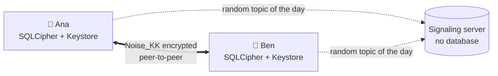
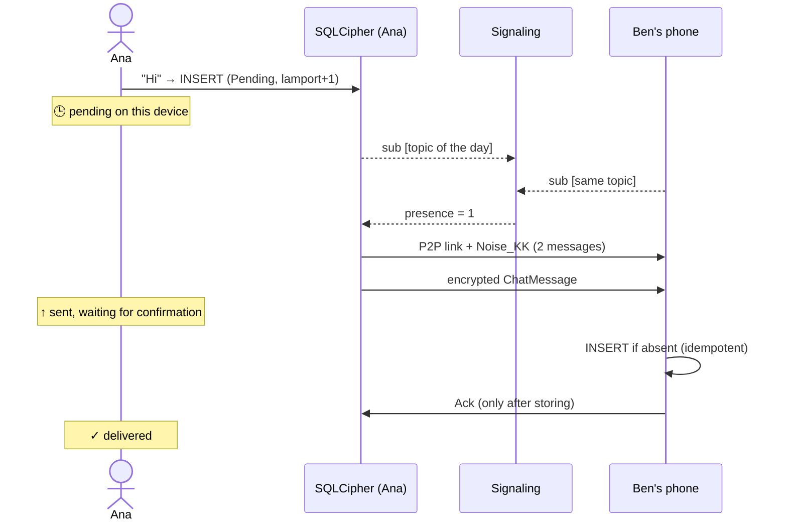
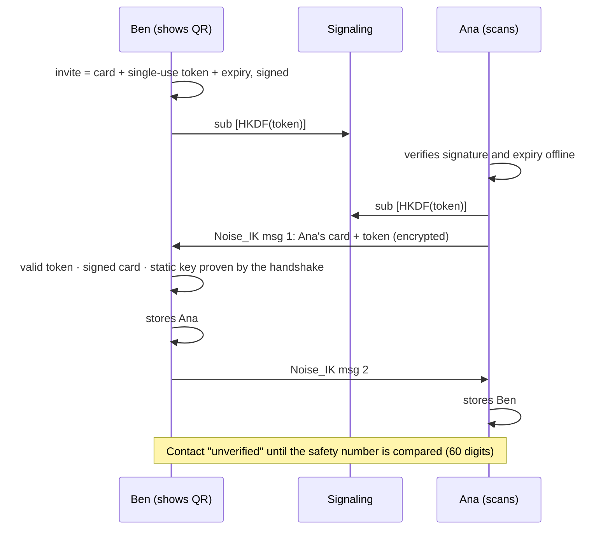
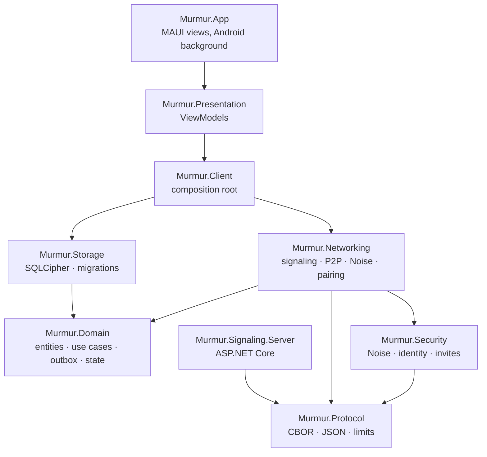

<p align="center">
  
</p>

<h1 align="center">Murmur</h1>

<p align="center">
  <b>Private messaging that is local-first, end-to-end encrypted and peer-to-peer.</b><br>
  No accounts, no phone number, no email. No server that stores your conversations.
</p>

<p align="center">
  <a href="https://fsoftt.github.io/Murmur/"><b>📖 Project site</b></a> ·
  <a href="docs/architecture.md">Architecture</a> ·
  <a href="docs/protocol/spec.md">Protocol</a> ·
  <a href="docs/threat-model.md">Threat model</a> ·
  <a href="docs/adr/README.md">Decisions</a> ·
  <a href="CONTRIBUTING.md">Contributing</a>
</p>

<p align="center">
  🇬🇧 English · <a href="README.es.md">🇪🇸 Español</a>
</p>

<p align="center">
  <a href="https://github.com/fsoftt/Murmur/actions/workflows/ci.yml"></a>
  <a href="https://fsoftt.github.io/Murmur/"></a>
  
  
  <a href="LICENSE"></a>
</p>

> [!WARNING]
> **Pre-alpha and not audited.** Do not use Murmur for sensitive communication until an
> independent security audit exists. See the [threat model](docs/threat-model.md).

---

## Contents

- [What it is](#what-it-is)
- [How it works, in one picture](#how-it-works-in-one-picture)
- [The rules of the game](#the-rules-of-the-game)
- [The life of a message](#the-life-of-a-message)
- [Delivering without opening the app](#delivering-without-opening-the-app)
- [Pairing with a QR code](#pairing-with-a-qr-code)
- [Architecture](#architecture)
- [Techniques and where they live in the code](#techniques-and-where-they-live-in-the-code)
- [Security and privacy](#security-and-privacy)
- [Tests and CI](#tests-and-ci)
- [Running it](#running-it)
- [Repository layout](#repository-layout)
- [Status and roadmap](#status-and-roadmap)
- [License](#license)

> The documents under `docs/` (architecture, ADRs, protocol, threat model) are written in Spanish.
> The [project site](https://fsoftt.github.io/Murmur/) is available in English and Spanish.

---

## What it is

Murmur is a messaging app with three properties that rarely come together:

1. **Local-first.** Your conversations live on your devices, in an encrypted database. No server keeps a copy.
2. **End-to-end encrypted.** Only the two phones in a conversation can read its messages.
3. **Peer-to-peer.** Messages travel straight from phone to phone; the server only helps them find each other.

> **Guiding principle:** if something can be done safely on the device, it needs a good reason to
> move to a server.

| Typical messengers | Murmur |
|---|---|
| You sign up with a phone number or email | Your identity is a key pair generated on your phone |
| The server stores messages until you fetch them | There is no mailbox: the message waits **on the sender's phone** |
| The server knows who talks to whom | Contacts exist only on the two phones |
| You add contacts by number | You pair **in person** by scanning a QR code |

## How it works, in one picture



- Each phone creates its **identity** (Ed25519 and X25519 keys) and keeps the private keys in the **Android Keystore**.
- Two people **pair by scanning a signed, single-use QR code**.
- Each pair derives a **rendezvous topic** that only the two of them can compute and that changes
  every day. The signaling server only sees "two connections on a random topic".
- When both phones are reachable they open a direct connection and a fresh **Noise handshake**, with
  *forward secrecy*.
- Messages are first saved to a **local outbox** (SQLCipher) and marked delivered only once the other
  side confirms it **stored** them.

## The rules of the game

Explicit product decisions, not fine print:

| Rule | Consequence |
|---|---|
| A message is delivered only when **both phones are reachable at the same time** | If the other person is not reachable, the message waits on your phone (🕒). No server holds it. |
| [Background delivery](#delivering-without-opening-the-app) | Your phone keeps trying every 15 minutes even with the app closed. With **Always available** on, it can also receive while closed. |
| Direct connection | **Your contacts see your public IP address** while you talk. |
| No TURN in the MVP | On some networks (strict carrier NAT, corporate networks) there is no direct path and messages stay pending. |
| No recovery | Losing the phone means losing the identity, contacts and history. |
| "Delete" deletes on your phone | Nobody can guarantee deletion on the other person's phone. |

## The life of a message



| If… | then… |
|---|---|
| the ACK is lost | the message is resent with exponential backoff and jitter; the receiver does not duplicate it and confirms again |
| the network drops | the session ends, reconnects with backoff, and anything unconfirmed is resent |
| the app is closed | the message stays in the database; a background job keeps trying |
| thousands of messages arrive | the receiver applies backpressure: 20/s after a burst of 200 |
| someone tampers with a byte | ChaCha20-Poly1305 detects it and the session is closed |
| the clocks disagree | Lamport clocks decide the order, not the time of day |
| the contact is blocked mid-session | nothing more is stored or acknowledged |

## Delivering without opening the app

Mobile operating systems suspend apps in the background, so Murmur offers two Android mechanisms
([ADR-012](docs/adr/ADR-012-background-delivery.md)). Neither stores anything on a server.

| Mechanism | What it does | Cost |
|---|---|---|
| **Background delivery** (always on) | A WorkManager job runs every 15 minutes with a network, and once when you leave the app. It starts the client and tries to deliver everything pending for a few minutes. | None visible. |
| **Always available** (opt-in) | A foreground service keeps the phone connected to the signaling service with the app closed, so contacts can reach it. It comes back after a reboot. | A permanent notification and some battery. Murmur warns you if battery optimization may pause it. |

With background delivery on the sender and *Always available* on the receiver, delivery no longer
depends on both people opening the app at the same time. Notifications for new messages show only
the contact's name, **never the text**. iOS will need a content-free push instead (separate decision).

## Pairing with a QR code



The QR code contains only **public keys** and a random token that expires after 10 minutes.

## Architecture

**Clean Architecture** with **MVVM**: dependencies point towards the domain, and the domain knows
nothing about SQLite, Noise, WebSockets or MAUI.



The transport between phones is pluggable (`IPeerLink`: reliable, ordered, message based). Noise
provides confidentiality on top, so no transport has to be trusted:

| Transport | Use |
|---|---|
| WebRTC DataChannel (binding of `stream-webrtc-android`) | Production, phase 4 |
| `InMemoryPeerLinkNetwork` | Tests: simulates unreachable NATs and dropped links |
| `DevRelayPeerLinkFactory` | Debug builds only: the encrypted channel through the server's relay |
| `UnavailablePeerLinkFactory` | Release builds until phase 4 |

More in [`docs/architecture.md`](docs/architecture.md) and on the
[site](https://fsoftt.github.io/Murmur/guide/architecture).

## Techniques and where they live in the code

| Technique | Why | Where |
|---|---|---|
| **Noise_KK / Noise_IK** (25519, ChaChaPoly, SHA-256) | Mutual authentication and fresh keys per connection (*forward secrecy*) | [`Security/Noise`](src/Murmur.Security/Noise) · [`SecureHandshake.cs`](src/Murmur.Networking/Secure/SecureHandshake.cs) |
| **Independent test vectors** | Our Noise produces the same bytes as `noiseprotocol` (Python) | [`NoiseVectorTests.cs`](tests/Murmur.Security.Tests/NoiseVectorTests.cs) |
| **Ed25519 / X25519** | Signing cards and invites; agreeing on secrets | [`Curve25519.cs`](src/Murmur.Security/Primitives/Curve25519.cs) · [`LocalIdentityKeys.cs`](src/Murmur.Security/Identity/LocalIdentityKeys.cs) |
| **ChaCha20-Poly1305** with counter nonces | Authenticated encryption; detects tampering, replay and reordering | [`ChaChaPoly.cs`](src/Murmur.Security/Primitives/ChaChaPoly.cs) · [`CipherState.cs`](src/Murmur.Security/Noise/CipherState.cs) |
| **HKDF** and rotating rendezvous topics | Presence without revealing identities | [`Rendezvous.cs`](src/Murmur.Security/Identity/Rendezvous.cs) |
| **Signed single-use invites** | QR pairing with no secrets in the code | [`InviteService.cs`](src/Murmur.Security/Identity/InviteService.cs) · [`PairingService.cs`](src/Murmur.Networking/Pairing/PairingService.cs) |
| **Safety number** (Signal style) and visual fingerprint | Detecting an impostor | [`SafetyNumber.cs`](src/Murmur.Security/Identity/SafetyNumber.cs) · [`Fingerprint.cs`](src/Murmur.Presentation/Formatting/Fingerprint.cs) |
| **Strict CBOR** with limits checked first | Compact, evolvable wire format that resists hostile input | [`Protocol/Frames`](src/Murmur.Protocol/Frames) · [`CborMap.cs`](src/Murmur.Protocol/Serialization/CborMap.cs) |
| **Transactional outbox** | No message is lost even if the app dies | [`SendMessage.cs`](src/Murmur.Domain/UseCases/SendMessage.cs) |
| **ACK after persisting + idempotent receive** | Neither losses nor duplicates | [`ConversationSyncSession.cs`](src/Murmur.Domain/Delivery/ConversationSyncSession.cs) · [`SqliteMessageRepository.cs`](src/Murmur.Storage/Repositories/SqliteMessageRepository.cs) |
| **Exponential backoff with jitter** | Retrying without overloading | [`Backoff.cs`](src/Murmur.Domain/Common/Backoff.cs) |
| **Lamport clocks** | Same order on both phones, immune to clock skew | [`MessageRules.cs`](src/Murmur.Domain/Model/MessageRules.cs) |
| **Explicit state machine** | Connection lifecycle without impossible states | [`PeerConnectionStateMachine.cs`](src/Murmur.Domain/Connections/PeerConnectionStateMachine.cs) |
| **Token bucket and backpressure** | Slowing a fast sender down without losing messages | [`TokenBucket.cs`](src/Murmur.Domain/Common/TokenBucket.cs) |
| **SQLCipher + Keystore** | Encrypted database; the key never sits next to the file | [`SqliteDatabase.cs`](src/Murmur.Storage/Database/SqliteDatabase.cs) · [`MauiSecretStore.cs`](src/Murmur.App/Services/MauiSecretStore.cs) |
| **Versioned migrations** | Evolving the schema without losing data | [`Migrations.cs`](src/Murmur.Storage/Database/Migrations.cs) |
| **WorkManager + foreground service** | Delivering and staying reachable with the app closed | [`OutboxWorker.cs`](src/Murmur.App/Platforms/Android/Background/OutboxWorker.cs) · [`AvailabilityForegroundService.cs`](src/Murmur.App/Platforms/Android/Background/AvailabilityForegroundService.cs) |
| **Abuse limits** on the server | Topics, members, connections per IP, rate, bounded queues | [`SignalingSession.cs`](src/Murmur.Signaling.Server/SignalingSession.cs) |
| **Clean Architecture + MVVM** | A dependency-free domain; view models testable on any OS | [`Murmur.Domain`](src/Murmur.Domain) · [`Murmur.Presentation`](src/Murmur.Presentation) |

Every technique has its own explanation page on [the site](https://fsoftt.github.io/Murmur/concepts/).

## Security and privacy

| | Content | Contacts | Who talks to whom | Your IP |
|---|---|---|---|---|
| **Signaling server** | ❌ | ❌ | Only "two connections share a random topic today" | ✅ |
| **Hostile network or Wi-Fi** | ❌ | ❌ | Traffic between two IPs | ✅ |
| **Your contact** | ✅ | — | — | ✅ |
| **Thief with your locked phone** | ❌ | ❌ | ❌ | — |
| **Malware on your unlocked phone** | ✅ | ✅ | ✅ | ✅ |

- Messages, keys, tokens, invites, topics and IP addresses are **never** logged.
- No analytics, advertising or crash-reporting SDKs. Android backups are disabled.
- A test records **all** of the server's traffic and checks that it contains no content, names or identity keys.
- Report vulnerabilities as described in [`SECURITY.md`](SECURITY.md).

## Tests and CI

137 automated tests:

| Project | Covers |
|---|---|
| `Murmur.Protocol.Tests` | Wire formats, forward compatibility, limits, **fuzzing** (20,000 inputs) |
| `Murmur.Security.Tests` | **Independent Noise vectors**, tampering, replay, invites, safety number, topics |
| `Murmur.Core.Tests` | Real SQLCipher (no plaintext on disk), repositories, Lamport, state machine, delivery with injected faults, blocking mid-session |
| `Murmur.IntegrationTests` | **Real server in process + two complete devices**: pairing, offline, sender offline, background delivery with the app closed, network drops, unreachable peer, blocking, restarts, the server sees no content, view models |

GitHub Actions runs formatting, a Release build with warnings as errors, tests with coverage, a
vulnerable-dependency check, the Android build with a downloadable debug APK, the signaling server's
Docker image, and the deployment of the site to GitHub Pages.

## Running it

Requirements: [.NET SDK 10](https://dotnet.microsoft.com/download). For the app:
`dotnet workload install maui-android` and the Android SDK.

```bash
# Tests (the solution excludes the MAUI app, so it builds on any OS)
dotnet test Murmur.slnx

# Signaling server
dotnet run --project src/Murmur.Signaling.Server --urls http://0.0.0.0:8080
# or
docker build -f src/Murmur.Signaling.Server/Dockerfile -t murmur-signaling .
docker run -p 8080:8080 murmur-signaling

# Android app (Debug: includes the development transport)
dotnet build src/Murmur.App -f net10.0-android -t:Run
```

The Android emulator points to `ws://10.0.2.2:8080/ws` by default; on real phones change the server
in **Settings**. In production the server sits behind a TLS proxy (Release builds require `wss://`);
set `ASPNETCORE_FORWARDEDHEADERS_ENABLED=true` if the proxy forwards the client's IP address.

Documentation site locally: `cd website && npm ci && npm run dev`.

## Repository layout

```text
src/
  Murmur.Domain/            Entities, use cases, delivery, state machine, ports
  Murmur.Protocol/          CBOR, signaling JSON, limits
  Murmur.Security/          Noise, identity, invites, safety number, topics
  Murmur.Storage/           SQLCipher, migrations, repositories
  Murmur.Networking/        Signaling client, transports, Noise session, connections, pairing
  Murmur.Client/            MurmurClient (composition root), background delivery pass
  Murmur.Presentation/      MVVM view models
  Murmur.App/               .NET MAUI app (Android), WorkManager job and foreground service
  Murmur.Signaling.Server/  ASP.NET Core server
tests/                      Unit, vectors, integration
docs/                       Architecture, protocol, threats, ADRs, original document (Spanish)
website/                    VitePress site (English and Spanish) published to GitHub Pages
```

## Status and roadmap

| Phase | Status |
|---|---|
| 1. Identity, Keystore, SQLCipher, domain, migrations | ✅ |
| 2. QR pairing and safety number | ✅ |
| 3. Signaling: presence, rotating topics, reconnection, limits | ✅ |
| 4. Real P2P with a WebRTC DataChannel | ⏳ next |
| 5. E2EE messages, outbox, ACK, idempotency, Lamport, backpressure | ✅ (on the simulated transport and the development relay) |
| 6. Background delivery and *Always available* (Android) | ✅ |
| 6b. Robustness on real devices, push for iOS | ⏳ |
| 7. Attachments | ⏳ |
| Independent security audit | ⏳ before any real use |

Deliberately out of the MVP: groups, calls, cloud backups, full multi-device, a self-hosted TURN,
Bluetooth, a user directory and a web version. The reasoning behind each decision is in the
[ADRs](docs/adr/README.md).

## License

Code under the **GNU AGPL-3.0-only** ([`LICENSE`](LICENSE)): any derivative, including a modified
server offered as a service, must remain auditable. Specification and documentation under
**CC BY 4.0** ([`docs/LICENSE-CC-BY-4.0.txt`](docs/LICENSE-CC-BY-4.0.txt)). Contributions under the
[DCO](CONTRIBUTING.md).
