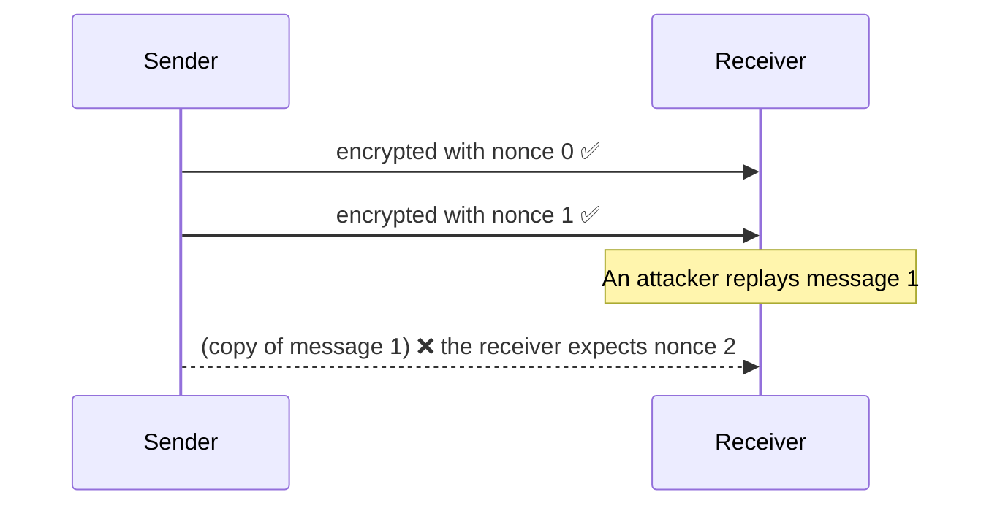

# Authenticated encryption and nonces

## AEAD: hiding content and detecting changes

Murmur encrypts every message with **ChaCha20-Poly1305**, an **AEAD** algorithm
(*Authenticated Encryption with Associated Data*):

- **ChaCha20** hides the content.
- **Poly1305** adds a 16-byte tag that detects **any** modification. If a single bit changes,
  decryption fails.

In Murmur, an authentication failure **closes the session** immediately, and the connection is
re-established from scratch.

## The nonce

Every encryption needs a **nonce** (*number used once*): a number that must never be repeated with
the same key. Reusing one breaks security.

Noise uses a **counter**: the first message is 0, the next is 1, and so on. Both sides keep track
of it, so it never travels over the network.

Consequences:

- **Replays and reordering are detected for free**: a repeated or out-of-order message does not decrypt.
- **The transport must be reliable and ordered**: losing a message desynchronises the counters. That
  is why the development relay rate-limits itself, so that the server does not drop frames
  ([backpressure](./backpressure)).
- **Encrypting and sending must go together**: if two threads encrypted at the same time and sent in
  a different order, the receiver would see out-of-order nonces. `SecureSession` serialises them
  with a lock.

**In the code:** [`ChaChaPoly.cs`](https://github.com/fsoftt/Murmur/blob/main/src/Murmur.Security/Primitives/ChaChaPoly.cs) ·
[`CipherState.cs`](https://github.com/fsoftt/Murmur/blob/main/src/Murmur.Security/Noise/CipherState.cs) ·
[`SecureSession.cs`](https://github.com/fsoftt/Murmur/blob/main/src/Murmur.Networking/Secure/SecureSession.cs)
