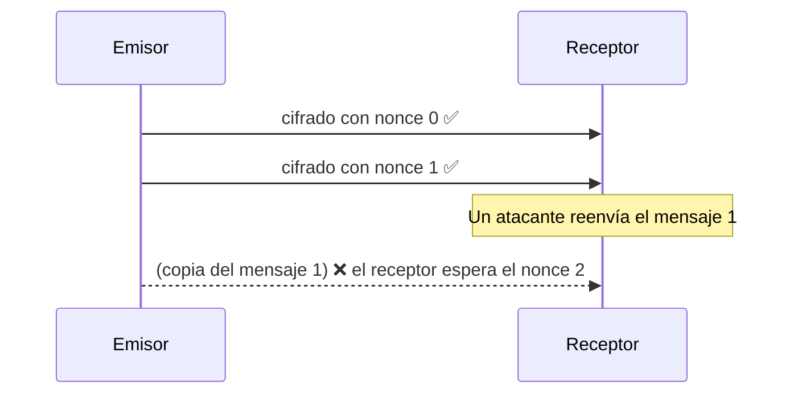

# Cifrado autenticado y nonces

## AEAD: ocultar y detectar cambios

Directo cifra cada mensaje con **ChaCha20-Poly1305**, un algoritmo **AEAD**
(*Authenticated Encryption with Associated Data*):

- **ChaCha20** oculta el contenido.
- **Poly1305** añade una etiqueta de 16 bytes que detecta **cualquier** modificación. Si cambia un
  solo bit, el descifrado falla.

En Directo, un fallo de autenticación **cierra la sesión** inmediatamente, y la conexión se vuelve a
establecer desde cero.

## El nonce

Cada cifrado necesita un **nonce** (*number used once*): un número que no debe repetirse nunca con
la misma clave. Reutilizarlo rompe la seguridad.

Noise usa un **contador**: el primer mensaje es el 0, el siguiente el 1, y así sucesivamente.
Ambos lados lo llevan, así que no viaja por la red.

Consecuencias:

- **Replay y reordenamiento se detectan solos**: un mensaje repetido o fuera de orden no descifra.
- **El transporte debe ser fiable y ordenado**: perder un mensaje desincroniza los contadores. Por
  eso el relay de desarrollo limita su ritmo, para que el servidor no descarte tramas
  ([contrapresión](./backpressure)).
- **Cifrar y enviar deben ir juntos**: si dos hilos cifraran a la vez y enviaran en otro orden, el
  receptor vería nonces desordenados. `SecureSession` lo serializa con un candado.

**En el código:** [`ChaChaPoly.cs`](https://github.com/fsoftt/Directo/blob/main/src/Directo.Security/Primitives/ChaChaPoly.cs) ·
[`CipherState.cs`](https://github.com/fsoftt/Directo/blob/main/src/Directo.Security/Noise/CipherState.cs) ·
[`SecureSession.cs`](https://github.com/fsoftt/Directo/blob/main/src/Directo.Networking/Secure/SecureSession.cs)
