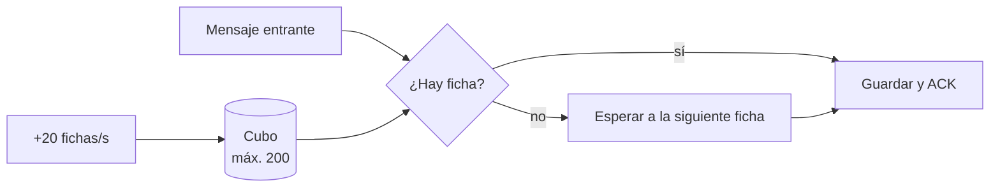

# Contrapresión y token bucket

## El problema

Un contacto (malicioso o con muchos mensajes pendientes) puede enviar miles de mensajes de golpe.
Hay dos formas de defenderse:

| Rechazar | Contrapresión |
|---|---|
| Cortar la conexión o descartar | **Leer más despacio**; el emisor espera |
| Un historial pendiente legítimo nunca termina de entregarse | Todo llega, a un ritmo acotado |

Murmur usa **contrapresión**.

## El token bucket

Un cubo se rellena de fichas a ritmo fijo hasta un máximo. Cada mensaje gasta una ficha. Si no quedan,
en lugar de rechazar se **espera** a la siguiente.

- **Mensajes entrantes:** ráfaga de 200 y después 20 por segundo. Un historial grande se vacía rápido
  al principio y luego a ritmo constante; un atacante no puede llenar el almacenamiento de golpe.
- **Relay de desarrollo:** 15 tramas/s con ráfaga de 60, por debajo del límite del servidor (20/s).
  Si el servidor descartara una trama, el [contador de nonces](./authenticated-encryption) se
  desincronizaría y la sesión se cortaría. Un test con 80 mensajes falla sin este limitador.
- **Servidor:** su propio token bucket por conexión; ahí sí se rechaza, porque protege un recurso compartido.

**En el código:** [`TokenBucket.cs`](https://github.com/fsoftt/Murmur/blob/main/src/Murmur.Domain/Common/TokenBucket.cs) ·
[`ConversationSyncSession.cs`](https://github.com/fsoftt/Murmur/blob/main/src/Murmur.Domain/Delivery/ConversationSyncSession.cs)
