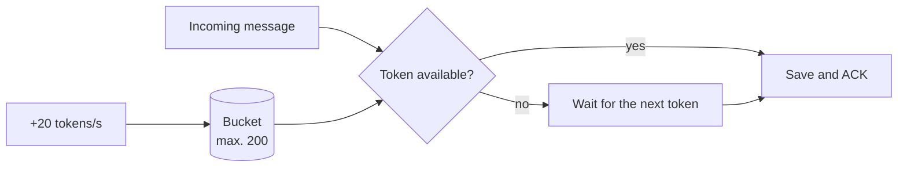

# Backpressure and token buckets

## The problem

A contact (malicious, or simply with lots of pending messages) can send thousands of messages at
once. There are two ways to defend against that:

| Rejecting | Backpressure |
|---|---|
| Drop the connection or discard messages | **Read more slowly**; the sender waits |
| A legitimate pending backlog never finishes delivering | Everything arrives, at a bounded rate |

Murmur uses **backpressure**.

## The token bucket

A bucket refills with tokens at a fixed rate up to a maximum. Each message spends one token. If none
are left, instead of rejecting the message it **waits** for the next one.

- **Incoming messages:** a burst of 200, then 20 per second. A large backlog drains quickly at first
  and then at a steady rate; an attacker cannot fill up storage in one go.
- **Development relay:** 15 frames/s with a burst of 60, below the server's limit (20/s). If the
  server dropped a frame, the [nonce counter](./authenticated-encryption) would fall out of sync and
  the session would be cut. A test with 80 messages fails without this limiter.
- **Server:** its own token bucket per connection; there it does reject, because it protects a shared
  resource.

**In the code:** [`TokenBucket.cs`](https://github.com/fsoftt/Murmur/blob/main/src/Murmur.Domain/Common/TokenBucket.cs) ·
[`ConversationSyncSession.cs`](https://github.com/fsoftt/Murmur/blob/main/src/Murmur.Domain/Delivery/ConversationSyncSession.cs)
