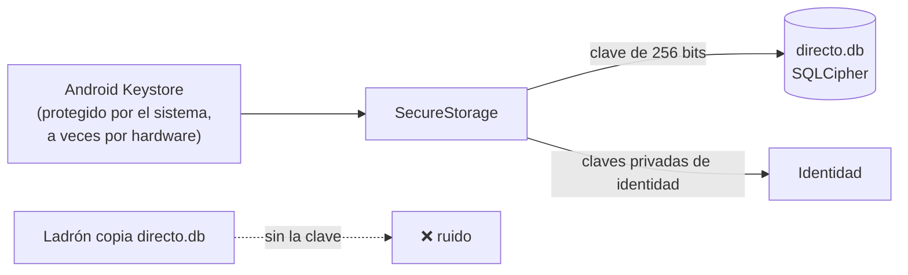

# Almacenamiento cifrado

## SQLCipher

**SQLCipher** es SQLite con **todo el fichero cifrado** (páginas de datos, índices y metadatos) con
AES-256. Sin la clave, el fichero parece ruido aleatorio: ni siquiera la cabecera "SQLite format 3"
es visible.

## Dónde vive la clave

- La clave es **aleatoria** (no una contraseña), así que se aplica en modo "clave cruda", sin pasar
  por una función de derivación lenta.
- Nunca se guarda junto a la base.
- Si SQLCipher no estuviera disponible, la app **se niega a abrir** la base en lugar de guardar en claro.
- Copias de seguridad de Android desactivadas: la base no sale del teléfono.

## Robustez

- Migraciones versionadas con `PRAGMA user_version`, cada una en su transacción.
- Tablas `STRICT`, claves foráneas con borrado en cascada, `secure_delete` y `synchronous = FULL`.
- Una única conexión serializada, con las consultas fuera del hilo de la interfaz.

**En el código:** [`SqliteDatabase.cs`](https://github.com/fsoftt/Directo/blob/main/src/Directo.Storage/Database/SqliteDatabase.cs) ·
[`Migrations.cs`](https://github.com/fsoftt/Directo/blob/main/src/Directo.Storage/Database/Migrations.cs) ·
[`MauiSecretStore.cs`](https://github.com/fsoftt/Directo/blob/main/src/Directo.App/Services/MauiSecretStore.cs)
