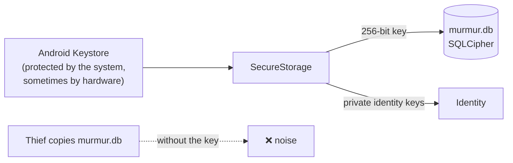

# Encrypted storage

## SQLCipher

**SQLCipher** is SQLite with **the whole file encrypted** (data pages, indexes and metadata) using
AES-256. Without the key, the file looks like random noise: not even the "SQLite format 3" header is
visible.

## Where the key lives

- The key is **random** (not a password), so it is applied in "raw key" mode, without going through
  a slow key-derivation function.
- It is never stored alongside the database.
- If SQLCipher were unavailable, the app **refuses to open** the database rather than storing data
  in plaintext.
- Android backups are disabled: the database never leaves the phone.

## Robustness

- Versioned migrations using `PRAGMA user_version`, each in its own transaction.
- `STRICT` tables, foreign keys with cascading deletes, `secure_delete` and `synchronous = FULL`.
- A single serialised connection, with queries running off the UI thread.

**In the code:** [`SqliteDatabase.cs`](https://github.com/fsoftt/Murmur/blob/main/src/Murmur.Storage/Database/SqliteDatabase.cs) ·
[`Migrations.cs`](https://github.com/fsoftt/Murmur/blob/main/src/Murmur.Storage/Database/Migrations.cs) ·
[`MauiSecretStore.cs`](https://github.com/fsoftt/Murmur/blob/main/src/Murmur.App/Services/MauiSecretStore.cs)
