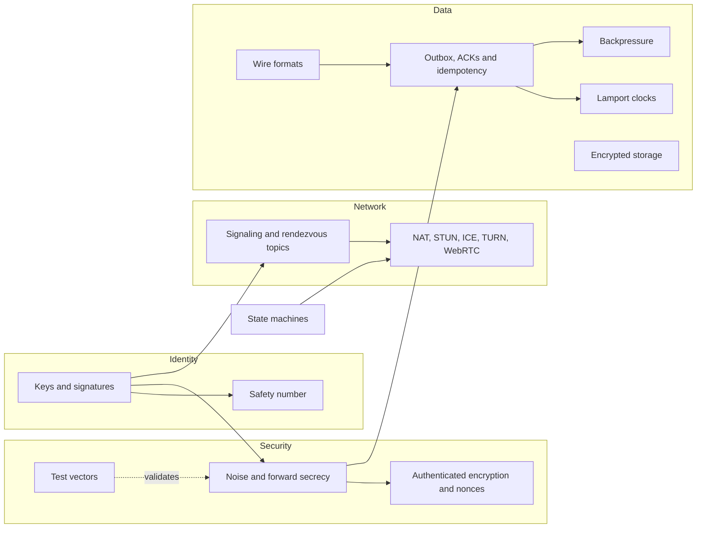

# Concept map

Murmur combines ideas from cryptography, networking and distributed systems. Each page explains a
concept from scratch, why we use it and **where it lives in the code**.

| Concept | In one sentence |
|---|---|
| [Keys, signatures and Diffie-Hellman](./keys-and-signatures) | Proving who you are and agreeing on a secret without sending it. |
| [Noise and forward secrecy](./noise) | The handshake that authenticates both sides and creates fresh keys on every connection. |
| [Authenticated encryption and nonces](./authenticated-encryption) | Hiding the message and detecting any change. |
| [Wire formats](./wire-formats) | How data is turned into bytes for the trip. |
| [Signaling and rendezvous topics](./rendezvous) | Meeting up without the server knowing who you are. |
| [NAT, STUN, ICE, TURN and WebRTC](./nat-and-p2p) | Why connecting two phones directly is hard. |
| [Outbox, ACKs and idempotency](./outbox-and-acks) | Never losing or duplicating messages. |
| [Lamport clocks](./lamport-clocks) | Ordering without trusting the phone's clock. |
| [State machines](./state-machines) | Explicit states instead of contradictory booleans. |
| [Backpressure and token bucket](./backpressure) | Slowing down whoever goes too fast without cutting them off. |
| [Encrypted storage](./encrypted-storage) | A file that is useless without the Keystore key. |
| [Safety number](./safety-number) | 60 digits to catch an impostor. |
| [Test vectors](./test-vectors) | How to know the cryptographic code is correct. |
