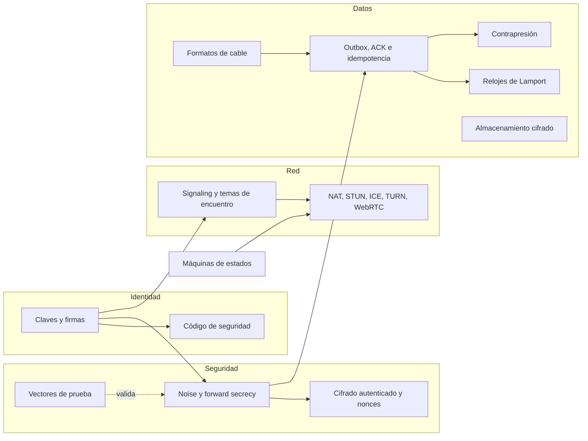

# Mapa de conceptos

Murmur combina ideas de criptografía, redes y sistemas distribuidos. Cada página explica un
concepto desde cero, por qué lo usamos y **dónde está en el código**.

| Concepto | En una frase |
|---|---|
| [Claves, firmas y Diffie-Hellman](./keys-and-signatures) | Demostrar quién eres y acordar un secreto sin enviarlo. |
| [Noise y forward secrecy](./noise) | El apretón de manos que autentica a los dos y crea claves nuevas en cada conexión. |
| [Cifrado autenticado y nonces](./authenticated-encryption) | Ocultar el mensaje y detectar cualquier cambio. |
| [Formatos de cable](./wire-formats) | Cómo se convierten los datos en bytes para viajar. |
| [Signaling y temas de encuentro](./rendezvous) | Encontrarse sin que el servidor sepa quién eres. |
| [NAT, STUN, ICE, TURN y WebRTC](./nat-and-p2p) | Por qué conectar dos teléfonos directamente es difícil. |
| [Outbox, ACK e idempotencia](./outbox-and-acks) | No perder ni duplicar mensajes. |
| [Relojes de Lamport](./lamport-clocks) | Ordenar sin fiarse de la hora del teléfono. |
| [Máquinas de estados](./state-machines) | Estados explícitos en lugar de booleanos contradictorios. |
| [Contrapresión y token bucket](./backpressure) | Frenar al que va demasiado rápido sin cortarlo. |
| [Almacenamiento cifrado](./encrypted-storage) | Un fichero que no sirve de nada sin la clave del Keystore. |
| [Código de seguridad](./safety-number) | 60 dígitos para detectar a un impostor. |
| [Vectores de prueba](./test-vectors) | Cómo saber que el código criptográfico es correcto. |
