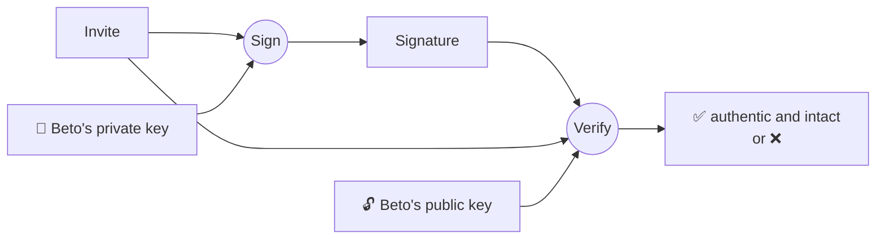
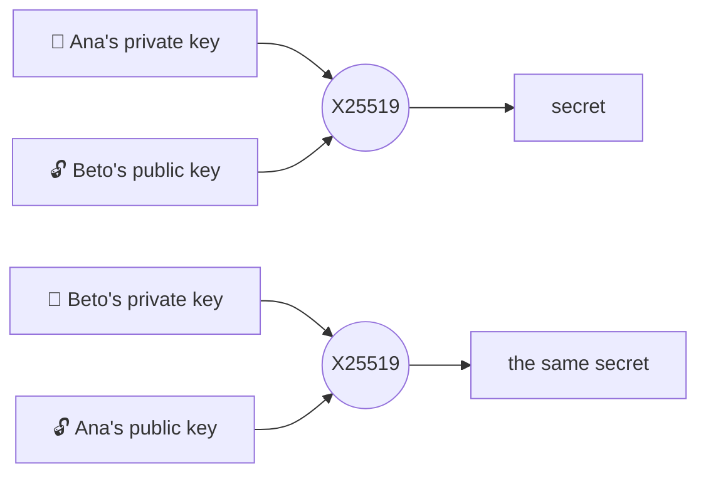

# Keys, signatures and Diffie-Hellman

## Public and private keys

A **key pair** is two mathematically related numbers. The **private** key never leaves the phone;
the **public** key can be shown to anyone. Whatever one of them does, only the other can check or
undo.

## Two curves, two jobs

| | Ed25519 | X25519 |
|---|---|---|
| What for | **Signing**: proving that something comes from you and that nobody changed it | **Agreeing on a secret** with someone else (Diffie-Hellman) |
| In Murmur | Signs the identity card and the QR invite | Noise handshakes and deriving rendezvous topics |
| Size | 32-byte key, 64-byte signature | 32-byte key |

### Signing



### Diffie-Hellman: the same secret without sending it



Each side combines **its own private key** with **the other's public key** and gets the same number.
That secret never travels over the network.

## Static and ephemeral

- **Static:** lasts as long as the installation. It is your identity for Noise.
- **Ephemeral:** created for a single connection and destroyed when it ends. It is the key to
  [forward secrecy](./noise#forward-secrecy).

## The identity card

```text
card = { identity key (Ed25519), static key (X25519),
         signature = Ed25519(identity, "Murmur/v1/identity-card" ‖ identity ‖ static) }
```

The signature binds the static key to the identity: nobody can present your identity with a
different static key. Keeping the two keys separate allows, in the future, one static key per device
under the same identity ([ADR-004](/guide/decisions#adr-004)).

## One important rule

**Never implement cryptographic primitives.** Murmur uses those from BouncyCastle and .NET through
minimal wrappers that also reject low-order keys (an all-zero X25519 result).

**In the code:** [`Curve25519.cs`](https://github.com/fsoftt/Murmur/blob/main/src/Murmur.Security/Primitives/Curve25519.cs) ·
[`LocalIdentityKeys.cs`](https://github.com/fsoftt/Murmur/blob/main/src/Murmur.Security/Identity/LocalIdentityKeys.cs) ·
[`IdentityCard.cs`](https://github.com/fsoftt/Murmur/blob/main/src/Murmur.Protocol/Identity/IdentityCard.cs)
