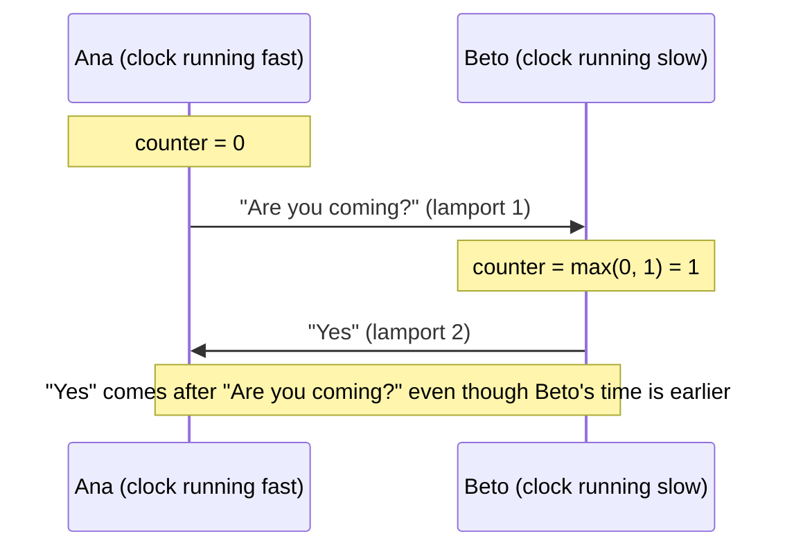

# Lamport clocks

## The problem

Phone clocks do not agree: one may be five minutes fast. If we ordered messages by time, a reply
could show up **before** the question.

## The idea

Each conversation keeps a **logical counter** instead of a time:

- **When sending:** `counter = counter + 1`, and the message carries that value.
- **When receiving:** `counter = max(counter, received value)`.

If B replies to something it has seen, its reply **always** has a higher value. The order respects
causality.

## A total order, identical on both phones

Two messages written at the same moment can have the same value. Ties are broken by creation time
and, finally, by id: `(lamport, created, id)`. Both phones have those same three values, so they
**show exactly the same order** (a test with concurrent writes checks this).

## Protection

A malicious peer could send a huge value to push the counter into overflow. Murmur caps what it
receives at `counter + 1,000,000`.

**In the code:** [`MessageRules.cs`](https://github.com/fsoftt/Murmur/blob/main/src/Murmur.Domain/Model/MessageRules.cs) ·
[`SqliteMessageRepository.cs`](https://github.com/fsoftt/Murmur/blob/main/src/Murmur.Storage/Repositories/SqliteMessageRepository.cs) ·
[ADR-011](/guide/decisions#adr-011)
