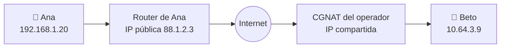
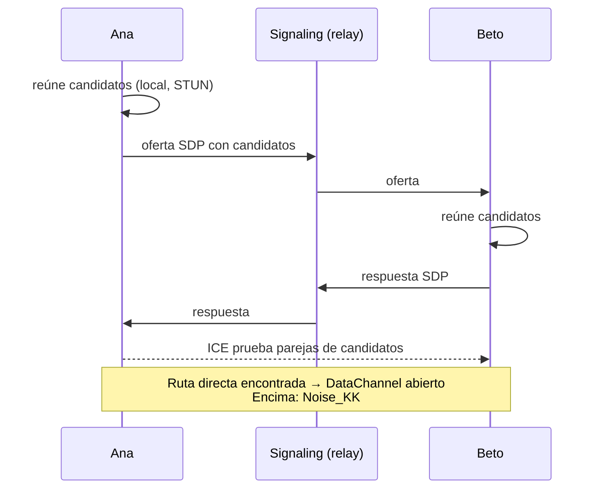

# NAT, STUN, ICE, TURN y WebRTC

## Por qué conectar dos teléfonos es difícil

Tu router comparte **una** IP pública entre todos tus dispositivos (**NAT**). Desde fuera nadie puede
abrir una conexión hacia tu teléfono: el router no sabe a cuál de tus dispositivos entregarla. Los
operadores móviles añaden otra capa (**CGNAT**).

## Las piezas

| Pieza | Qué hace |
|---|---|
| **STUN** | Un servidor sencillo que te dice "así te veo desde Internet" (tu IP y puerto públicos). |
| **ICE** | Reúne todas las rutas posibles (red local, IP pública vía STUN, relay) y las prueba por parejas hasta que una funciona. |
| **Hole punching** | Ambos envían paquetes a la vez para que sus routers "abran la puerta" a la respuesta. |
| **TURN** | Un servidor que **reenvía** todo el tráfico cuando no hay ruta directa. |
| **WebRTC DataChannel** | Un estándar que empaqueta ICE, STUN, TURN y cifrado DTLS, y da un canal fiable y ordenado. |

## Las decisiones de Murmur

- **Sin TURN** en el MVP ([ADR-002](/guide/decisions#adr-002)): no queremos un servidor que retransmita
  el tráfico. Algunas redes no tendrán ruta directa y los mensajes seguirán pendientes. Hay que
  **medir** cuántas antes de decidir para siempre.
- **No confiamos en el cifrado de WebRTC:** Noise va por encima, así que el transporte solo tiene que
  ser fiable y ordenado.
- **Transporte intercambiable:** todo habla con `IPeerLink`. Hoy existen la red simulada de los tests
  y el relay de desarrollo; WebRTC llega en la fase 4 mediante un binding de `stream-webrtc-android`
  ([ADR-003](/guide/decisions#adr-003)).
- **Tu contacto ve tu IP pública**: es inherente a una conexión directa.

**En el código:** [`IPeerLink.cs`](https://github.com/fsoftt/Murmur/blob/main/src/Murmur.Networking/Links/IPeerLink.cs) ·
[`InMemoryPeerLinkNetwork.cs`](https://github.com/fsoftt/Murmur/blob/main/src/Murmur.Networking/Links/InMemoryPeerLinkNetwork.cs) ·
[`DevRelayPeerLinkFactory.cs`](https://github.com/fsoftt/Murmur/blob/main/src/Murmur.Networking/Links/DevRelayPeerLinkFactory.cs)
