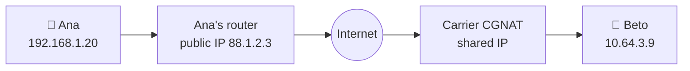
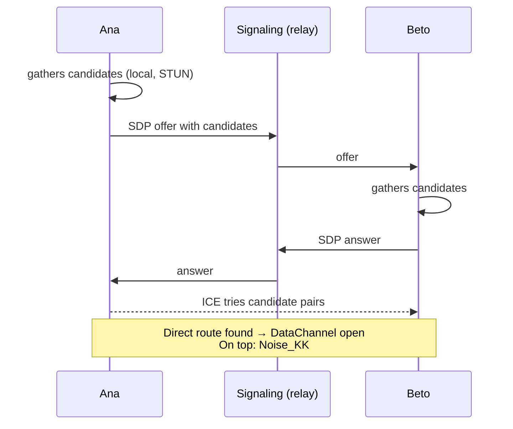

# NAT, STUN, ICE, TURN and WebRTC

## Why connecting two phones is hard

Your router shares **one** public IP address among all your devices (**NAT**). Nobody outside can
open a connection to your phone: the router does not know which of your devices to deliver it to.
Mobile carriers add yet another layer (**CGNAT**).

## The pieces

| Piece | What it does |
|---|---|
| **STUN** | A simple server that tells you "this is how I see you from the Internet" (your public IP and port). |
| **ICE** | Gathers every possible route (local network, public IP via STUN, relay) and tries them in pairs until one works. |
| **Hole punching** | Both sides send packets at the same time so their routers "open the door" to the reply. |
| **TURN** | A server that **forwards** all traffic when there is no direct route. |
| **WebRTC DataChannel** | A standard that bundles ICE, STUN, TURN and DTLS encryption, and provides a reliable, ordered channel. |

## Murmur's decisions

- **No TURN** in the MVP ([ADR-002](/guide/decisions#adr-002)): we do not want a server relaying the
  traffic. Some networks will have no direct route and messages will stay pending. We need to
  **measure** how many before deciding for good.
- **We do not rely on WebRTC's encryption:** Noise runs on top, so the transport only has to be
  reliable and ordered.
- **Swappable transport:** everything talks to `IPeerLink`. Today there is the simulated network used
  by the tests and the development relay; WebRTC arrives in phase 4 through a binding of
  `stream-webrtc-android` ([ADR-003](/guide/decisions#adr-003)).
- **Your contact sees your public IP address**: this is inherent to a direct connection.

**In the code:** [`IPeerLink.cs`](https://github.com/fsoftt/Murmur/blob/main/src/Murmur.Networking/Links/IPeerLink.cs) ·
[`InMemoryPeerLinkNetwork.cs`](https://github.com/fsoftt/Murmur/blob/main/src/Murmur.Networking/Links/InMemoryPeerLinkNetwork.cs) ·
[`DevRelayPeerLinkFactory.cs`](https://github.com/fsoftt/Murmur/blob/main/src/Murmur.Networking/Links/DevRelayPeerLinkFactory.cs)
