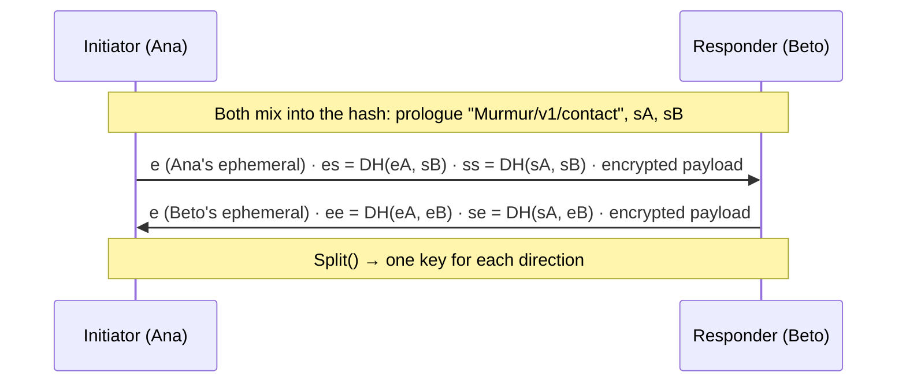
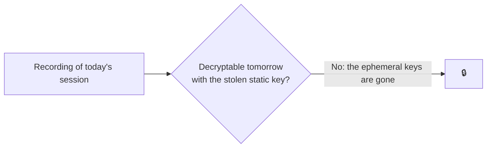

# Noise and forward secrecy

## What Noise is

[Noise](https://noiseprotocol.org) is not an algorithm: it is a **framework for building handshakes**,
the exchange in which two parties authenticate each other and agree on keys. It is used by WireGuard,
Lightning and WhatsApp (between the app and its servers). It has a precise, heavily analysed
specification, so there is nothing to invent.

A Noise protocol is described by its name:

```text
Noise_KK_25519_ChaChaPoly_SHA256
      │  │      │          └─ hash function
      │  │      └─ authenticated encryption
      │  └─ Diffie-Hellman
      └─ pattern: what each side knows in advance
```

## The patterns Murmur uses

| Pattern | Meaning | When |
|---|---|---|
| **KK** | Both sides **know** (*Known*) each other's static key | Every conversation between already-paired contacts |
| **IK** | The initiator knows the other's key and sends its own **immediately** (*Immediately*), encrypted | Pairing: the inviter's static key is in the QR code |

### Noise_KK step by step



Each DH operation is mixed into a **chaining key** with HKDF. The result depends on all **four**
keys (two static and two ephemeral): an impostor without the static private key does not get the
same keys, and the first encrypted message fails.

## Forward secrecy

Ephemeral keys are created for that connection and **wiped from memory** when it ends. If someone
steals the phone and its static key tomorrow, they **cannot decrypt** what they recorded today: they
are missing the ephemeral keys, which no longer exist.



## Why not Double Ratchet?

Double Ratchet (Signal) solves a different problem: encrypting for someone who is **offline** via a
mailbox, and decrypting messages that arrive out of order days later. Murmur has no mailbox: it only
delivers when both sides are connected over a reliable, ordered channel. A fresh handshake per
connection gives the same *forward secrecy* with no ratchet state to store, sync or lose
([ADR-005](/guide/decisions#adr-005)).

What is lost: *post-compromise security* within a single session, and sessions in Murmur are short.

## Prologue and version

The **prologue** (`Murmur/v1/contact` or `Murmur/v1/pairing`) is mixed into the hash: if the two
sides are not speaking exactly the same protocol, the handshake fails. The handshake payloads
advertise their supported version range, and the highest common version is negotiated.

**In the code:** [`HandshakeState.cs`](https://github.com/fsoftt/Murmur/blob/main/src/Murmur.Security/Noise/HandshakeState.cs) ·
[`SymmetricState.cs`](https://github.com/fsoftt/Murmur/blob/main/src/Murmur.Security/Noise/SymmetricState.cs) ·
[`SecureHandshake.cs`](https://github.com/fsoftt/Murmur/blob/main/src/Murmur.Networking/Secure/SecureHandshake.cs) ·
validated against [independent vectors](./test-vectors).
