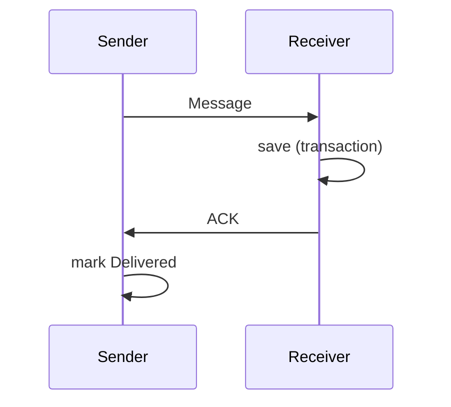
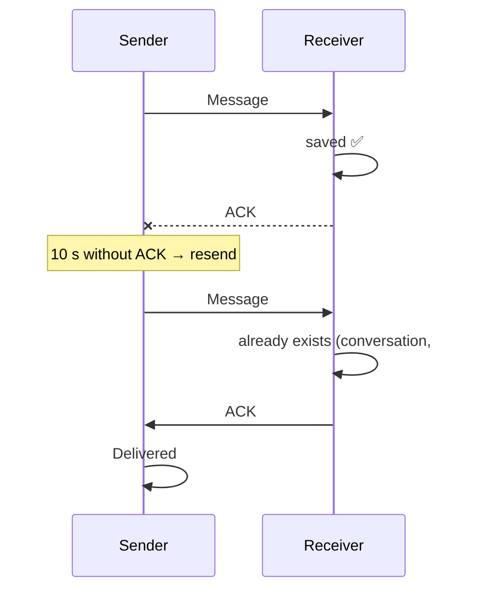

# Outbox, ACKs and idempotency

Three ideas from distributed systems that guarantee a message is **neither lost nor duplicated**.

## Transactional outbox

When you tap "Send", the message is **first saved** to the local database and only then is sending
attempted:

```text
BEGIN
  lamport = lamport + 1
  INSERT message (state = Pending)
COMMIT
→ wake up the session, if there is one
```

If the app dies in between, the message is still there. The "outbox" is the set of outgoing messages
in the *Pending* or *Sent* state.

## ACK after persisting

"The bytes left my phone" does **not** mean "the other side has it". Only an **ACK** confirms that,
and the receiver sends it **after** saving the message:



## Idempotency

An operation is **idempotent** if doing it twice has the same effect as doing it once. This is
essential because ACKs get lost:



The primary key `(conversation, id)` prevents the duplicate from being inserted.

## Retransmission with backoff and jitter

Without an ACK, the message is resent with ever-longer waits: **exponential backoff** (10 s, 20 s,
40 s… up to 2 min). Each wait includes a random margin, the **jitter**, so that thousands of devices
do not all retry at once. The same applies to reconnecting to the server or to a contact.

## Protections against a malicious peer

- An ACK only marks as delivered **outgoing** messages in **that** conversation.
- An incoming message carrying the id of one of our own messages is ignored.

**In the code:** [`SendMessage.cs`](https://github.com/fsoftt/Murmur/blob/main/src/Murmur.Domain/UseCases/SendMessage.cs) ·
[`ConversationSyncSession.cs`](https://github.com/fsoftt/Murmur/blob/main/src/Murmur.Domain/Delivery/ConversationSyncSession.cs) ·
[`SqliteMessageRepository.cs`](https://github.com/fsoftt/Murmur/blob/main/src/Murmur.Storage/Repositories/SqliteMessageRepository.cs) ·
[`Backoff.cs`](https://github.com/fsoftt/Murmur/blob/main/src/Murmur.Domain/Common/Backoff.cs)
