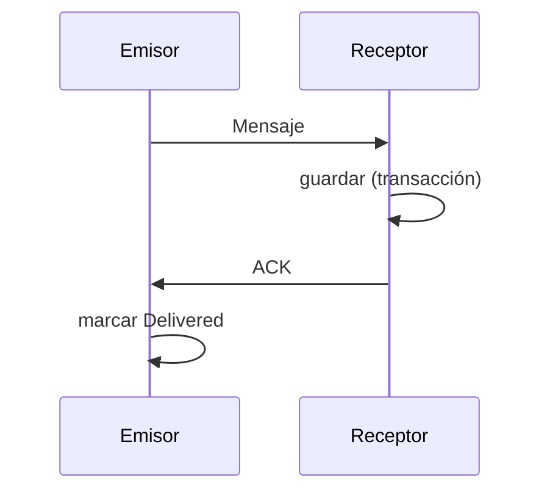
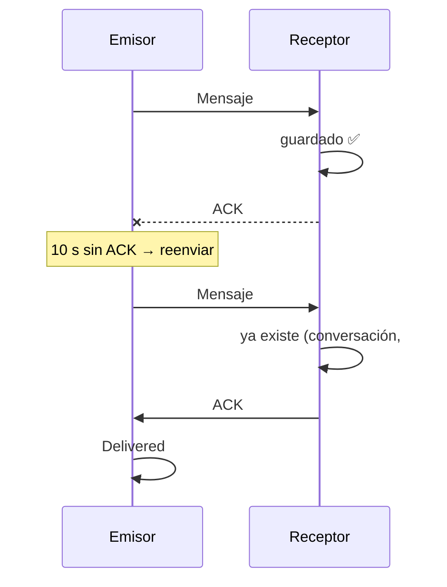

# Outbox, ACK e idempotencia

Tres ideas de sistemas distribuidos que garantizan que un mensaje **no se pierda ni se duplique**.

## Outbox transaccional

Al pulsar "Enviar", el mensaje **primero se guarda** en la base local y después se intenta enviar:

```text
BEGIN
  lamport = lamport + 1
  INSERT mensaje (estado = Pending)
COMMIT
→ despertar a la sesión, si hay una
```

Si la app muere entre medias, el mensaje sigue ahí. El "outbox" son los mensajes salientes en estado
*Pending* o *Sent*.

## ACK después de persistir

"Los bytes salieron de mi teléfono" **no** significa "el otro lo tiene". Solo un **ACK** lo confirma,
y el receptor lo envía **después** de guardar el mensaje:



## Idempotencia

Una operación es **idempotente** si hacerla dos veces tiene el mismo efecto que hacerla una. Es
imprescindible porque los ACK se pierden:



La clave primaria `(conversación, id)` hace que el duplicado no se inserte.

## Retransmisión con backoff y jitter

Sin ACK, se reenvía esperando cada vez más: **backoff exponencial** (10 s, 20 s, 40 s… hasta 2 min).
Cada espera lleva un margen aleatorio, el **jitter**, para que miles de dispositivos no reintenten
todos a la vez. Lo mismo vale para reconectar al servidor o a un contacto.

## Las protecciones contra un par malicioso

- Un ACK solo marca como entregados mensajes **salientes** de **esa** conversación.
- Un mensaje entrante con el id de uno propio se ignora.

**En el código:** [`SendMessage.cs`](https://github.com/fsoftt/Directo/blob/main/src/Directo.Domain/UseCases/SendMessage.cs) ·
[`ConversationSyncSession.cs`](https://github.com/fsoftt/Directo/blob/main/src/Directo.Domain/Delivery/ConversationSyncSession.cs) ·
[`SqliteMessageRepository.cs`](https://github.com/fsoftt/Directo/blob/main/src/Directo.Storage/Repositories/SqliteMessageRepository.cs) ·
[`Backoff.cs`](https://github.com/fsoftt/Directo/blob/main/src/Directo.Domain/Common/Backoff.cs)
