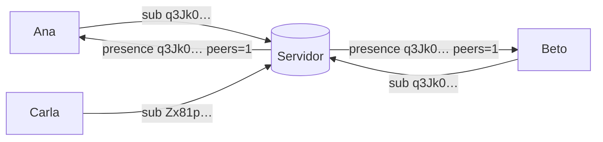

# Signaling y temas de encuentro

## El problema

Los teléfonos cambian de IP constantemente (casa → 5G → oficina). Para conectarse necesitan un punto
de encuentro: el **servidor de signaling**. Pero la forma ingenua revela demasiado:

```text
Ana → servidor: "¿Está Beto conectado?"     ← el servidor aprende que Ana conoce a Beto
```

## La solución: temas que solo la pareja puede calcular

Ana y Beto comparten un secreto que nunca enviaron: el
[Diffie-Hellman](./keys-and-signatures#diffie-hellman-el-mismo-secreto-sin-enviarlo) de sus claves
estáticas. De él derivan, con **HKDF**, un **tema** de 32 bytes que cambia cada día:

```text
tema = HKDF-SHA256(secreto = X25519(mi estática, su estática),
                   sal     = "Murmur/v1/rendezvous/contact",
                   info    = día UTC)
```



El servidor ve "dos conexiones en el tema `q3Jk0…`", nunca nombres ni claves. Al día siguiente el
tema es otro y no puede enlazarlos solo por él.

## HKDF

**HKDF** es una función para **derivar** valores: entra un secreto, una etiqueta (*sal*) y un
contexto (*info*), y sale un valor de apariencia aleatoria. Etiquetas distintas dan resultados
independientes, así que el mismo secreto sirve para el tema sin debilitar nada más.

## Detalles

- **Medianoche UTC:** cerca del cambio de día, cada teléfono se suscribe también al tema vecino,
  para tolerar relojes desfasados. Ambos eligen el **menor** tema en el que el otro está presente.
- **Quién inicia:** el de clave estática menor, para que los dos no intenten conectarse a la vez.
- **Emparejamiento:** antes de ser contactos no hay secreto compartido; el tema se deriva del token
  del QR.
- **Relay:** el servidor reenvía pequeños blobs entre los miembros de un tema. Sirve para negociar la
  conexión P2P, **no** para mensajes.

## Lo que el servidor sigue viendo

IPs, horarios y que dos conexiones comparten un tema durante un día. Es metadata reducida, no cero
([privacidad](/guide/privacy)).

**En el código:** [`Rendezvous.cs`](https://github.com/fsoftt/Murmur/blob/main/src/Murmur.Security/Identity/Rendezvous.cs) ·
[`SignalingClient.cs`](https://github.com/fsoftt/Murmur/blob/main/src/Murmur.Networking/Signaling/SignalingClient.cs) ·
[`SignalingSession.cs`](https://github.com/fsoftt/Murmur/blob/main/src/Murmur.Signaling.Server/SignalingSession.cs)
