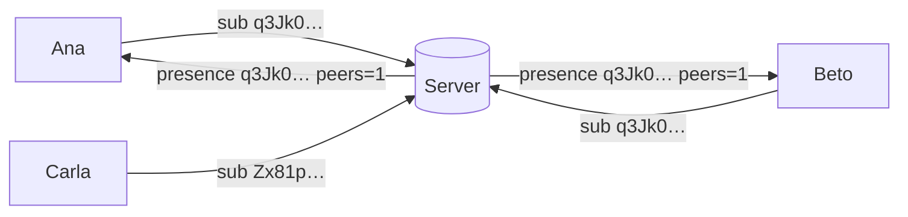

# Signaling and rendezvous topics

## The problem

Phones change IP address all the time (home → 5G → office). To connect, they need a meeting point:
the **signaling server**. But the naive approach reveals too much:

```text
Ana → server: "Is Beto online?"     ← the server learns that Ana knows Beto
```

## The solution: topics only the pair can compute

Ana and Beto share a secret they never sent: the
[Diffie-Hellman](./keys-and-signatures#diffie-hellman-the-same-secret-without-sending-it) of their
static keys. From it they derive, with **HKDF**, a 32-byte **topic** that changes every day:

```text
topic = HKDF-SHA256(secret = X25519(my static, their static),
                    salt   = "Murmur/v1/rendezvous/contact",
                    info   = UTC day)
```



The server sees "two connections on topic `q3Jk0…`", never names or keys. The next day the topic is
different, and the server cannot link the two days from the topic alone.

## HKDF

**HKDF** is a function for **deriving** values: you feed in a secret, a label (*salt*) and a context
(*info*), and out comes a random-looking value. Different labels give independent results, so the
same secret can be used for the topic without weakening anything else.

## Details

- **UTC midnight:** close to the day change, each phone also subscribes to the neighbouring day's
  topic, to tolerate clock skew. Both pick the **lowest** topic on which the other is present.
- **Who initiates:** the side with the lower static key, so the two do not try to connect at the
  same time.
- **Pairing:** before becoming contacts there is no shared secret; the topic is derived from the
  QR token.
- **Relay:** the server forwards small blobs between the members of a topic. It is used to negotiate
  the P2P connection, **not** for messages.

## What the server still sees

IP addresses, timing, and the fact that two connections share a topic for a day. It is reduced
metadata, not zero ([privacy](/guide/privacy)).

**In the code:** [`Rendezvous.cs`](https://github.com/fsoftt/Murmur/blob/main/src/Murmur.Security/Identity/Rendezvous.cs) ·
[`SignalingClient.cs`](https://github.com/fsoftt/Murmur/blob/main/src/Murmur.Networking/Signaling/SignalingClient.cs) ·
[`SignalingSession.cs`](https://github.com/fsoftt/Murmur/blob/main/src/Murmur.Signaling.Server/SignalingSession.cs)
