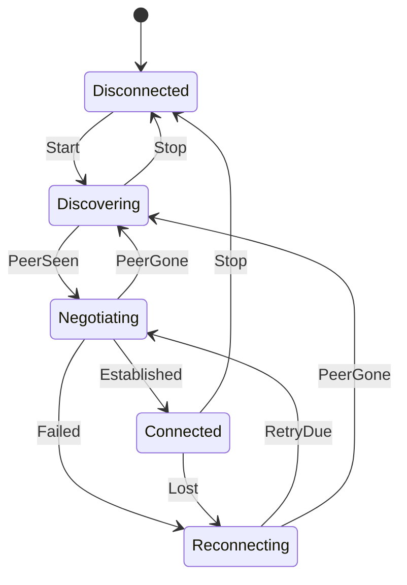

# State machines

## The trouble with booleans

```csharp
bool isConnected, isConnecting, isRetrying, hasPeer;   // 16 combinations, most of them impossible
```

What does `isConnected && isRetrying` mean? With several asynchronous tasks touching those variables,
sooner or later an impossible state shows up.

## The alternative

A **single** explicit state and a table of allowed transitions. Anything else is rejected.



| State | What the user sees |
|---|---|
| Discovering | "Not online. Your messages will be delivered when you are both online, even if you close the app." |
| Negotiating | "Connecting…" |
| Connected | "Connected directly" |
| Reconnecting | "No direct connection. Your messages are still pending on this device." |

Each contact has its own machine. Note that `Connected` does **not** react to `PeerGone`: if the
signaling server goes down, the direct connection stays alive.

Messages have their own machine (`Pending → Sent → Delivered`), and the database only allows valid
transitions (for example, an ACK cannot "un-deliver" a message).

**In the code:** [`PeerConnectionStateMachine.cs`](https://github.com/fsoftt/Murmur/blob/main/src/Murmur.Domain/Connections/PeerConnectionStateMachine.cs) ·
[`ContactConnection.cs`](https://github.com/fsoftt/Murmur/blob/main/src/Murmur.Networking/Sessions/ContactConnection.cs)
