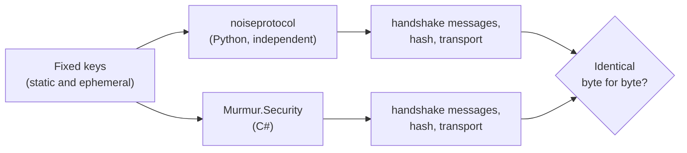

# Test vectors

## The problem with cryptographic code

A bug in cryptography rarely breaks anything visible: the program encrypts and decrypts perfectly…
against itself. If our Noise implementation had a subtle bug (a byte order, a key mixed in wrongly),
two phones running **the same** code would still understand each other, and the bug would go
unnoticed.

## The solution

A **test vector** is a fixed input together with its exact known output, produced by **another,
independent implementation**. If ours produces exactly the same bytes, it implements the
specification and not a homegrown variant.

Murmur's vectors cover **Noise_KK** and **Noise_IK**: both handshake messages, the handshake hash
and three transport messages in each direction. The script that generated them is in the repository,
so anyone can reproduce them.

## What complements the vectors

- Negative tests: a different prologue, the wrong key, a flipped bit, a replay, an out-of-turn message.
- Fuzzing of the parsers.
- And, before any real-world use, **an independent audit**.

**In the code:** [`NoiseVectorTests.cs`](https://github.com/fsoftt/Murmur/blob/main/tests/Murmur.Security.Tests/NoiseVectorTests.cs) ·
[`noise-vectors.json`](https://github.com/fsoftt/Murmur/blob/main/tests/Murmur.Security.Tests/TestVectors/noise-vectors.json) ·
[`generate_noise_vectors.py`](https://github.com/fsoftt/Murmur/blob/main/tests/Murmur.Security.Tests/TestVectors/generate_noise_vectors.py)
