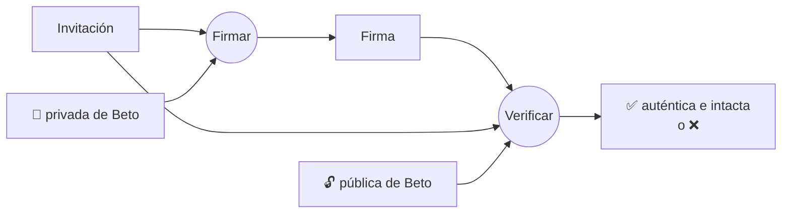
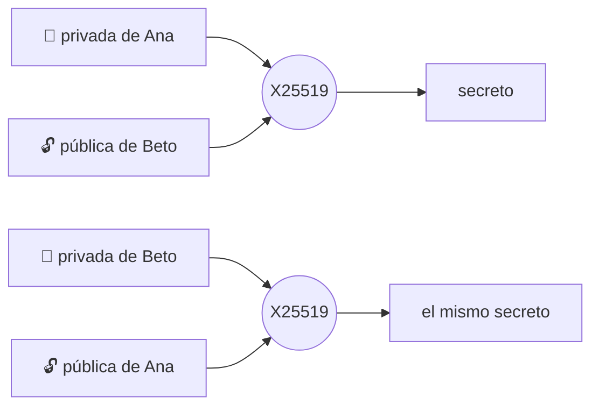

# Claves, firmas y Diffie-Hellman

## Clave pública y privada

Un **par de claves** son dos números relacionados matemáticamente. La **privada** nunca sale del
teléfono; la **pública** se puede enseñar a cualquiera. Lo que hace una solo puede comprobarlo o
deshacerlo la otra.

## Dos curvas, dos trabajos

| | Ed25519 | X25519 |
|---|---|---|
| Para qué | **Firmar**: demostrar que algo viene de ti y que nadie lo cambió | **Acordar un secreto** con otra persona (Diffie-Hellman) |
| En Murmur | Firma de la tarjeta de identidad y de la invitación QR | Handshakes Noise y derivación de temas de encuentro |
| Tamaño | Clave de 32 bytes, firma de 64 | Clave de 32 bytes |

### Firmar



### Diffie-Hellman: el mismo secreto sin enviarlo



Cada uno combina **su privada** con **la pública del otro** y obtiene el mismo número. Ese secreto
nunca viaja por la red.

## Estáticas y efímeras

- **Estática:** dura lo que dure la instalación. Es tu identidad para Noise.
- **Efímera:** se crea para una sola conexión y se destruye al terminar. Es la clave de la
  [forward secrecy](./noise#forward-secrecy).

## La tarjeta de identidad

```text
tarjeta = { clave de identidad (Ed25519), clave estática (X25519),
            firma = Ed25519(identidad, "Murmur/v1/identity-card" ‖ identidad ‖ estática) }
```

La firma ata la estática a la identidad: nadie puede presentar tu identidad con otra estática.
Separar ambas claves permite, en el futuro, una estática por dispositivo bajo la misma identidad
([ADR-004](/es/guide/decisions#adr-004)).

## Una regla importante

**Nunca implementar primitivas criptográficas.** Murmur usa las de BouncyCastle y .NET a través de
envoltorios mínimos que también rechazan claves de orden bajo (un resultado X25519 todo ceros).

**En el código:** [`Curve25519.cs`](https://github.com/fsoftt/Murmur/blob/main/src/Murmur.Security/Primitives/Curve25519.cs) ·
[`LocalIdentityKeys.cs`](https://github.com/fsoftt/Murmur/blob/main/src/Murmur.Security/Identity/LocalIdentityKeys.cs) ·
[`IdentityCard.cs`](https://github.com/fsoftt/Murmur/blob/main/src/Murmur.Protocol/Identity/IdentityCard.cs)
