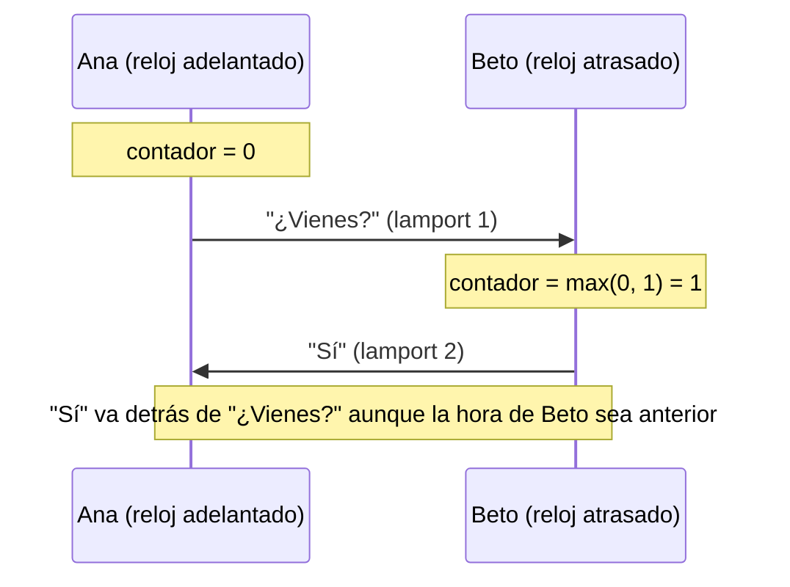

# Relojes de Lamport

## El problema

Los relojes de los teléfonos no coinciden: uno puede ir cinco minutos adelantado. Si ordenáramos por
hora, una respuesta podría aparecer **antes** que la pregunta.

## La idea

Cada conversación lleva un **contador lógico** en lugar de una hora:

- **Al enviar:** `contador = contador + 1` y el mensaje lleva ese valor.
- **Al recibir:** `contador = máximo(contador, valor recibido)`.

Si B responde a algo que vio, su respuesta **siempre** tiene un valor mayor. El orden respeta la
causalidad.

## Orden total, idéntico en ambos teléfonos

Dos mensajes escritos a la vez pueden tener el mismo valor. Se desempata con la hora de creación y,
por último, con el id: `(lamport, creación, id)`. Ambos teléfonos tienen esos mismos tres datos, así
que **muestran exactamente el mismo orden** (lo comprueba un test con escrituras concurrentes).

## Protección

Un par malicioso podría enviar un valor enorme para llevar el contador al desbordamiento. Murmur
acota lo recibido a `contador + 1 000 000`.

**En el código:** [`MessageRules.cs`](https://github.com/fsoftt/Murmur/blob/main/src/Murmur.Domain/Model/MessageRules.cs) ·
[`SqliteMessageRepository.cs`](https://github.com/fsoftt/Murmur/blob/main/src/Murmur.Storage/Repositories/SqliteMessageRepository.cs) ·
[ADR-011](/es/guide/decisions#adr-011)
