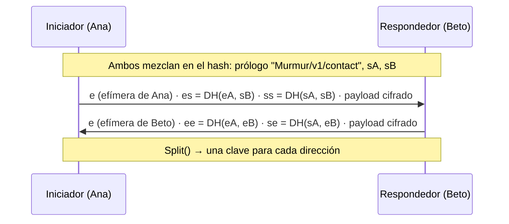
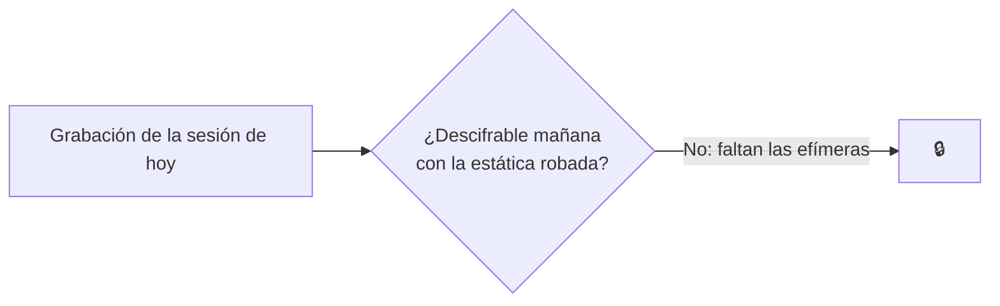

# Noise y forward secrecy

## Qué es Noise

[Noise](https://noiseprotocol.org) no es un algoritmo: es un **marco para construir handshakes**, el
"apretón de manos" en el que dos partes se autentican y acuerdan claves. Lo usan WireGuard, Lightning
y WhatsApp (entre la app y sus servidores). Tiene una especificación precisa y muy analizada, así que
no hay que inventar nada.

Un protocolo Noise se describe con un nombre:

```text
Noise_KK_25519_ChaChaPoly_SHA256
      │  │      │          └─ función hash
      │  │      └─ cifrado autenticado
      │  └─ Diffie-Hellman
      └─ patrón: qué sabe cada lado de antemano
```

## Los patrones que usa Murmur

| Patrón | Significado | Cuándo |
|---|---|---|
| **KK** | Ambos **conocen** (*Known*) la clave estática del otro | Cada conversación entre contactos ya emparejados |
| **IK** | El que inicia conoce la del otro y le envía la suya **inmediatamente** (*Immediately*), cifrada | El emparejamiento: la estática del invitador está en el QR |

### Noise_KK paso a paso



Cada operación DH se mezcla en una **clave encadenada** con HKDF. El resultado depende de las
**cuatro** claves (dos estáticas y dos efímeras): un impostor sin la privada estática no obtiene las
mismas claves y el primer mensaje cifrado falla.

## Forward secrecy

Las efímeras se crean para esa conexión y se **borran de la memoria** al terminar. Si mañana alguien
roba el teléfono y su clave estática, **no puede descifrar** lo que grabó hoy: le faltan las efímeras,
que ya no existen.



## ¿Por qué no Double Ratchet?

Double Ratchet (Signal) resuelve otro problema: cifrar para alguien **offline** a través de un
buzón y descifrar mensajes que llegan desordenados días después. Murmur no tiene buzón: solo entrega
con los dos conectados en un canal fiable y ordenado. Un handshake nuevo por conexión da la misma
*forward secrecy* sin estado de ratchet que guardar, sincronizar o perder ([ADR-005](/es/guide/decisions#adr-005)).

Lo que se pierde: *post-compromise security* dentro de una misma sesión, que en Murmur son cortas.

## Prólogo y versión

El **prólogo** (`Murmur/v1/contact` o `Murmur/v1/pairing`) se mezcla en el hash: si los dos lados
no hablan exactamente el mismo protocolo, el handshake falla. Los payloads del handshake anuncian el
rango de versiones y se negocia la mayor común.

**En el código:** [`HandshakeState.cs`](https://github.com/fsoftt/Murmur/blob/main/src/Murmur.Security/Noise/HandshakeState.cs) ·
[`SymmetricState.cs`](https://github.com/fsoftt/Murmur/blob/main/src/Murmur.Security/Noise/SymmetricState.cs) ·
[`SecureHandshake.cs`](https://github.com/fsoftt/Murmur/blob/main/src/Murmur.Networking/Secure/SecureHandshake.cs) ·
validado con [vectores independientes](./test-vectors).
