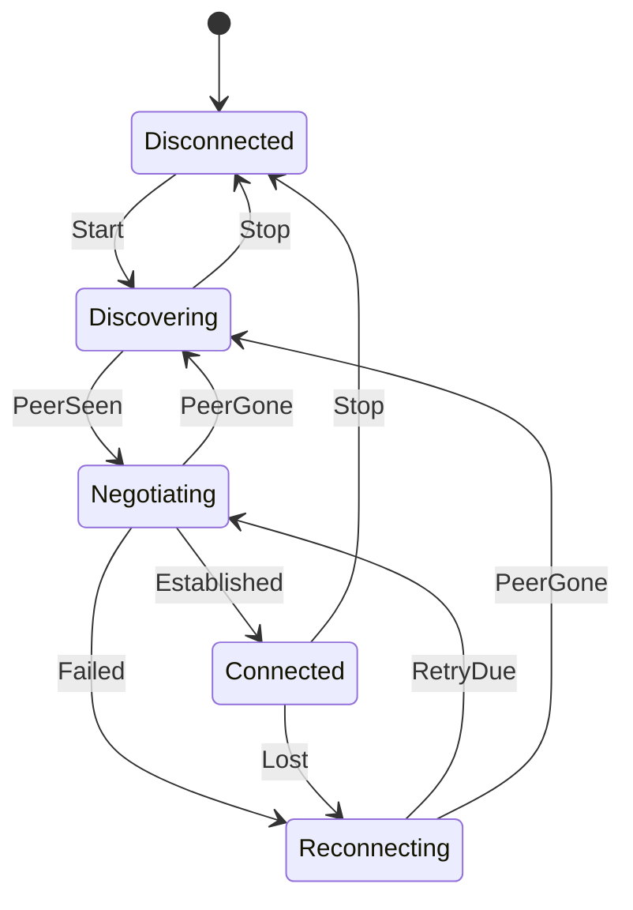

# Máquinas de estados

## El problema de los booleanos

```csharp
bool isConnected, isConnecting, isRetrying, hasPeer;   // 16 combinaciones, la mayoría imposibles
```

¿Qué significa `isConnected && isRetrying`? Con varias tareas asíncronas tocando esas variables,
tarde o temprano aparece un estado imposible.

## La alternativa

Un **único** estado explícito y una tabla con las transiciones permitidas. Cualquier otra se rechaza.



| Estado | Qué ve el usuario |
|---|---|
| Discovering | "No está en línea. Tus mensajes se entregarán cuando coincidáis, aunque cierres la app." |
| Negotiating | "Conectando…" |
| Connected | "Conectado directamente" |
| Reconnecting | "Sin conexión directa. Tus mensajes siguen pendientes en este dispositivo." |

Cada contacto tiene su propia máquina. Fíjate en que `Connected` **no** reacciona a `PeerGone`: si
el servidor de signaling cae, la conexión directa sigue viva.

Los mensajes tienen su propia máquina (`Pending → Sent → Delivered`) y la base de datos solo permite
las transiciones válidas (por ejemplo, un ACK no puede "des-entregar" un mensaje).

**En el código:** [`PeerConnectionStateMachine.cs`](https://github.com/fsoftt/Murmur/blob/main/src/Murmur.Domain/Connections/PeerConnectionStateMachine.cs) ·
[`ContactConnection.cs`](https://github.com/fsoftt/Murmur/blob/main/src/Murmur.Networking/Sessions/ContactConnection.cs)
