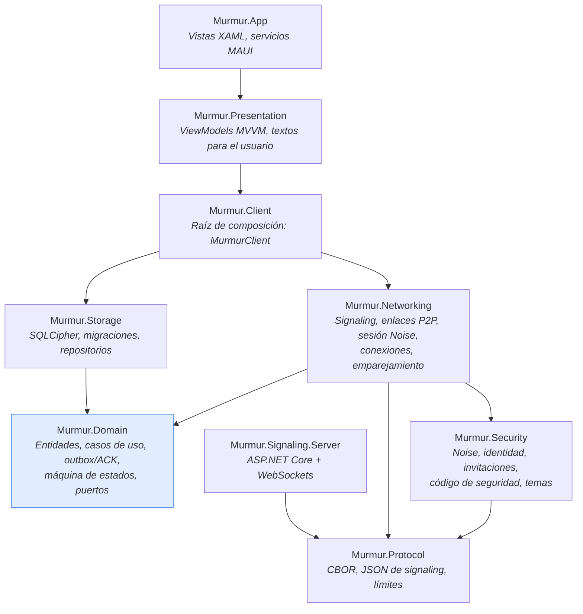
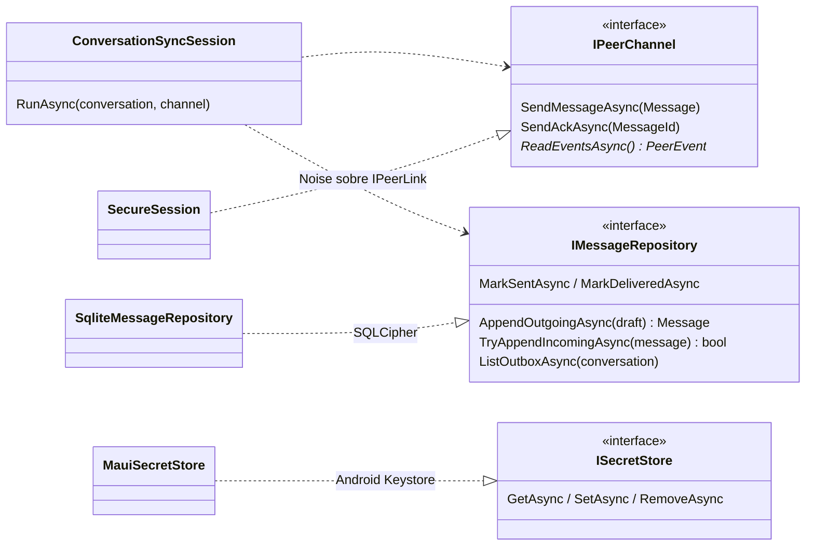
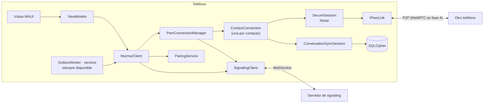
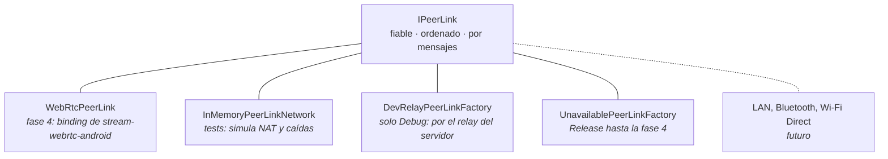

# Arquitectura

Murmur sigue **Clean Architecture** con **MVVM** en la presentación: las dependencias apuntan hacia
el dominio y el dominio no conoce SQLite, Noise, WebSockets ni MAUI.

## Proyectos y dependencias

| Proyecto | Responsabilidad | Depende de |
|---|---|---|
| `Murmur.Domain` | Modelo (`Contact`, `Conversation`, `Message`), reglas, casos de uso (`SendMessage`, `ManageContacts`), motor de entrega (`ConversationSyncSession`), máquina de estados, puertos (`IMessageRepository`, `IPeerChannel`, `ISecretStore`) | nada |
| `Murmur.Protocol` | Formatos de cable: frames CBOR, tarjetas de identidad, invitaciones, mensajes de signaling, límites | `System.Formats.Cbor` |
| `Murmur.Security` | Noise KK/IK, claves locales, invitaciones firmadas, código de seguridad, derivación de temas | Protocol, BouncyCastle |
| `Murmur.Storage` | `SqliteDatabase` (SQLCipher), migraciones, repositorios | Domain |
| `Murmur.Networking` | `SignalingClient`, `IPeerLink` y sus implementaciones, `SecureSession`, `PeerConnectionManager`, `PairingService` | Domain, Protocol, Security |
| `Murmur.Client` | `MurmurClient`: ensambla identidad, base de datos, red y casos de uso | Networking, Storage |
| `Murmur.Presentation` | ViewModels testeables en cualquier SO | Client |
| `Murmur.App` | Vistas, `SecureStorage`, navegación Shell, QR | Presentation |
| `Murmur.Signaling.Server` | Presencia y relay sobre WebSocket | Protocol |

## Los puertos del dominio

El dominio define **qué necesita**; la infraestructura decide **cómo**:

Gracias a esto, el motor de entrega se prueba con un canal en memoria y una base SQLCipher real,
sin red, sin criptografía y sin emulador.

## Componentes en tiempo de ejecución

- **`PeerConnectionManager`** calcula los temas de cada contacto, se suscribe y crea una
  `ContactConnection` por contacto no bloqueado.
- **`ContactConnection`** espera a que el contacto esté presente, abre el enlace, hace el handshake
  Noise y ejecuta la sincronización. Si algo falla, reintenta con backoff.
- **`ConversationSyncSession`** vacía el outbox, retransmite lo no confirmado y guarda lo recibido.
- **`ClientHost`** comparte un único `MurmurClient` por proceso entre la interfaz, el trabajo de
  WorkManager (`OutboxWorker`) y el servicio en primer plano "siempre disponible"
  ([ADR-012](/es/guide/decisions#adr-012)).

## Transportes intercambiables

La confidencialidad la pone **Noise por encima**, así que ningún transporte necesita ser de confianza.

## El servidor de signaling

Un único endpoint WebSocket (`/ws`). Mantiene en memoria qué conexiones están suscritas a qué tema
y reenvía pequeños blobs opacos. **No tiene base de datos.**

| Protección | Valor por defecto |
|---|---|
| Temas por conexión | 512 |
| Conexiones por tema | 8 |
| Conexiones por IP (IPv6 agrupado por /64) | 32 |
| Mensajes por conexión | 20/s, ráfaga de 100 |
| Tamaño de trama / blob de relay | 32 KiB / 16 KiB |
| Cola de salida | 256 (cliente lento = desconectado) |
| Tiempo para enviar `hello` | 10 s |

La membresía está detrás de `ITopicHub`, para poder escalar horizontalmente con pub/sub sin tocar
el protocolo.
