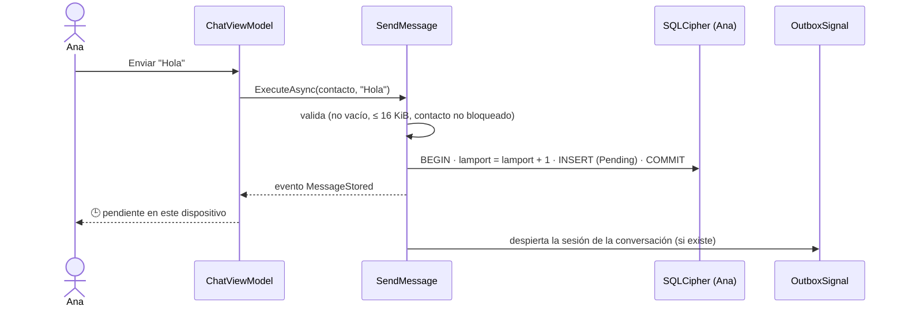
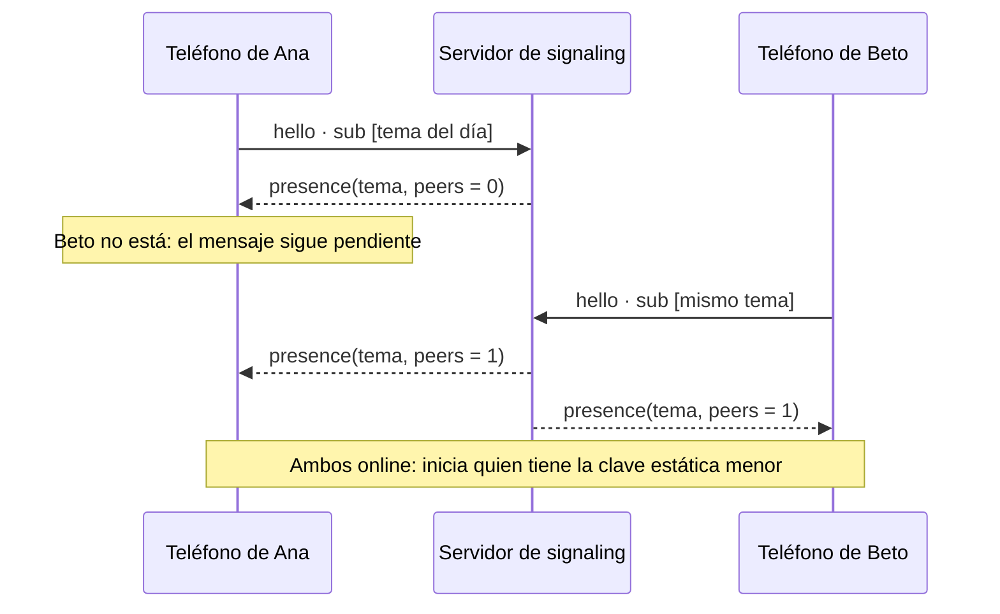
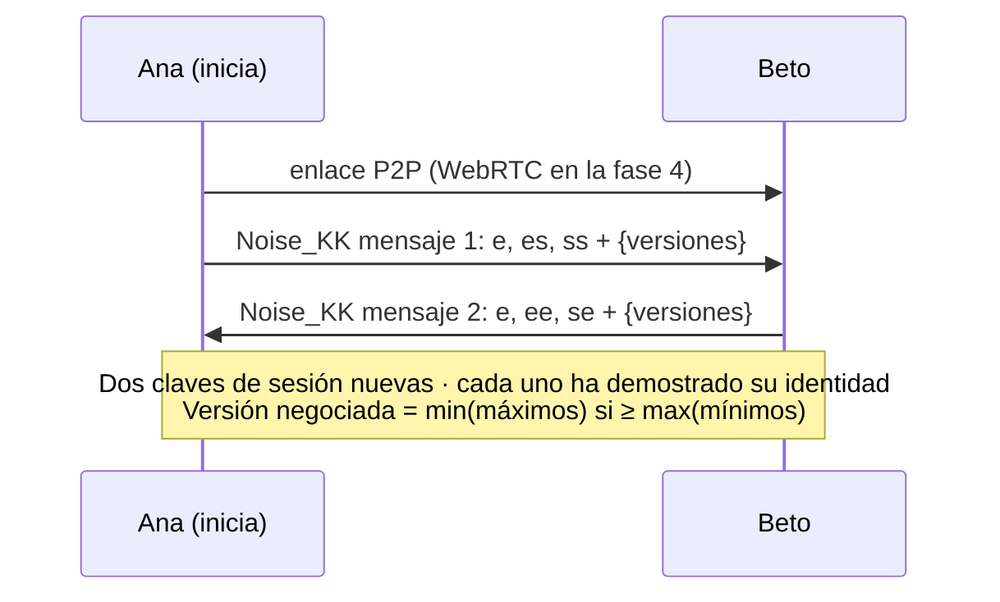
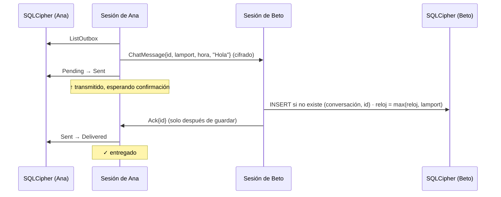
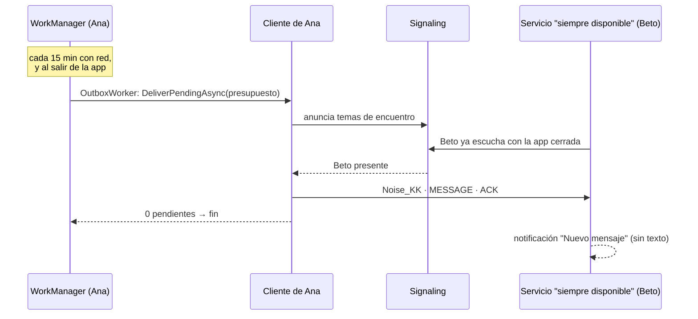
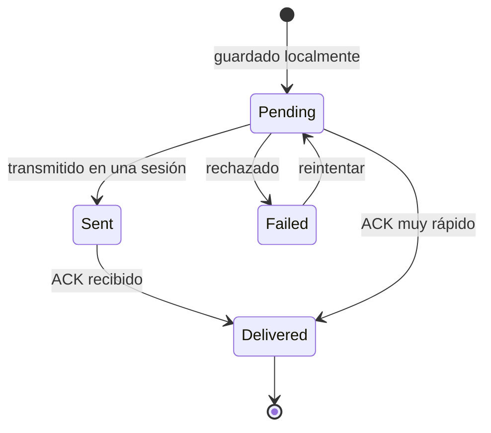

# La vida de un mensaje

Ana escribe "Hola" a Beto. Así viaja ese mensaje, paso a paso.

## 1. Escribir: primero se guarda

El mensaje existe **antes** de intentar enviarlo. Si la app muere ahora, no se pierde nada.

## 2. Encontrarse

El tema es `HKDF(DH(estáticaAna, estáticaBeto), día)`: solo ellos dos pueden calcularlo.
[Más sobre temas de encuentro](/es/concepts/rendezvous).

## 3. Conectarse y autenticarse

Si alguien se hace pasar por Beto, el handshake falla: no tiene su clave privada.
[Más sobre Noise](/es/concepts/noise).

## 4. Entregar y confirmar

### ¿Y si algo sale mal?

| Fallo | Qué pasa |
|---|---|
| Se pierde el ACK | Sin ACK en 10 s, Ana reenvía (10 s → 20 s → … → 2 min, con jitter). Beto ya lo tiene: no lo duplica y vuelve a confirmar. |
| Se corta la red | La sesión termina; `ContactConnection` pasa a *Reconnecting* y reintenta. Lo no confirmado se reenvía en la siguiente sesión. |
| Ana cierra la app | El mensaje sigue en su base como *Pending* o *Sent*. Se reenvía al volver. |
| Beto recibe 10 000 mensajes de golpe | Contrapresión: los lee a 20/s tras una ráfaga de 200, sin cortar la sesión. |
| Alguien manipula un byte | ChaCha20-Poly1305 lo detecta, la sesión se cierra y se reconecta. |
| Los relojes de los teléfonos difieren | El orden lo da el reloj de Lamport, no la hora. |

## Sin abrir la app {#sin-abrir-la-app}

Android suspende las apps en segundo plano, así que Murmur se apoya en dos mecanismos
([ADR-012](/es/guide/decisions#adr-012)):

- **Quien envía** no necesita la app abierta: el trabajo arranca el cliente, espera los ACK hasta
  agotar su presupuesto de tiempo y se detiene. Lo que quede pendiente se reintenta en el siguiente.
- **Quien recibe** puede activar **Siempre disponible** en Ajustes: un servicio en primer plano con
  una notificación fija mantiene el teléfono localizable y se reactiva al reiniciar. Sin él, recibe
  la próxima vez que abra la app.
- El servidor sigue sin guardar nada y las notificaciones nunca muestran el texto.

## 5. Estados que ve el usuario

🕒 pendiente en este dispositivo · ↑ transmitido, esperando confirmación · ✓ entregado · ! no entregado.
La app **nunca** dice "enviado" cuando el mensaje solo está en tu teléfono.
