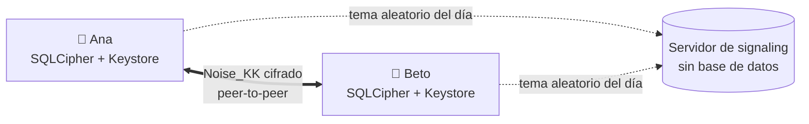

## De un vistazo

  
<strong>App</strong>.NET MAUI (Android primero, iOS después), XAML + MVVM con CommunityToolkit.Mvvm

  
<strong>Criptografía</strong>Noise KK/IK, X25519, Ed25519, ChaCha20-Poly1305, HKDF sobre BouncyCastle

  
<strong>Almacenamiento</strong>SQLite + SQLCipher, clave en Android Keystore, migraciones versionadas

  
<strong>Protocolo</strong>CBOR estricto entre teléfonos, JSON en el signaling, especificación pública

  
<strong>Servidor</strong>ASP.NET Core + WebSockets: presencia y relay de negociación, sin persistencia

  
<strong>Arquitectura</strong>Clean Architecture, dominio sin dependencias, puertos e interfaces pequeñas

  
<strong>Pruebas</strong>xUnit, vectores de Noise, fuzzing de parsers, integración con servidor real

  
<strong>Licencia</strong>AGPL-3.0 para el código, CC BY 4.0 para la especificación

## Cómo funciona, en una imagen

El servidor solo les ayuda a **encontrarse**. Los mensajes van de teléfono a teléfono y únicamente
los dos extremos pueden leerlos.

::: warning Estado: pre-alfa y sin auditar
No uses Murmur para comunicaciones sensibles hasta que exista una auditoría de seguridad
independiente. Consulta [Privacidad y amenazas](/es/guide/privacy).
:::

