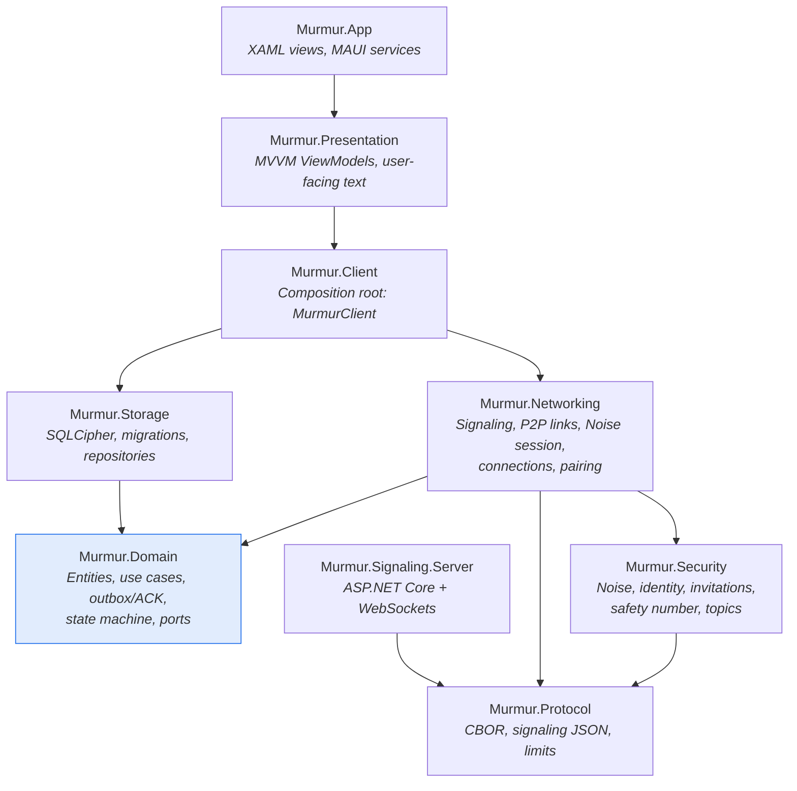
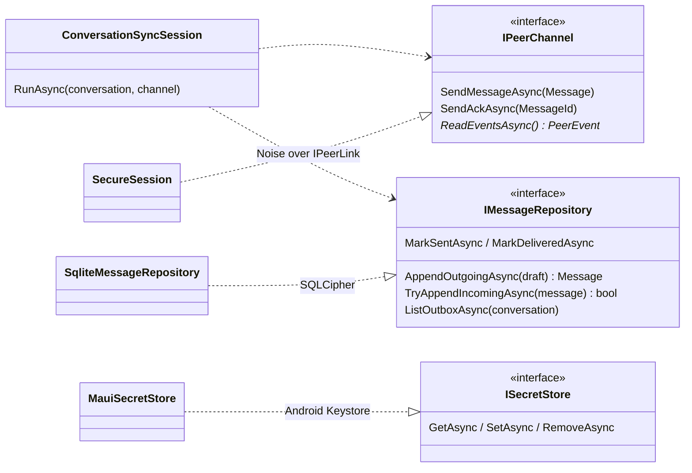
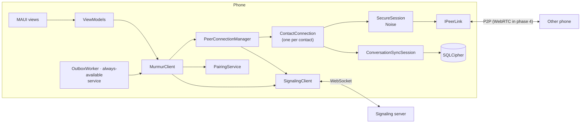
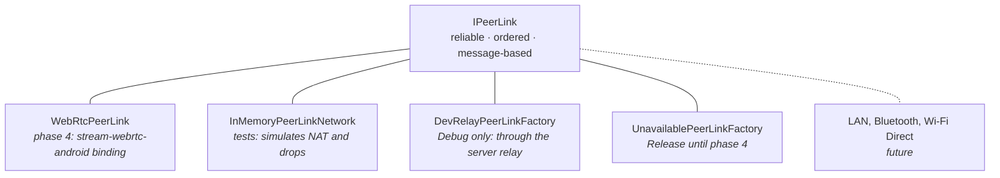

# Architecture

Murmur follows **Clean Architecture** with **MVVM** in the presentation layer: dependencies point
toward the domain, and the domain knows nothing about SQLite, Noise, WebSockets or MAUI.

## Projects and dependencies

| Project | Responsibility | Depends on |
|---|---|---|
| `Murmur.Domain` | Model (`Contact`, `Conversation`, `Message`), rules, use cases (`SendMessage`, `ManageContacts`), delivery engine (`ConversationSyncSession`), state machine, ports (`IMessageRepository`, `IPeerChannel`, `ISecretStore`) | nothing |
| `Murmur.Protocol` | Wire formats: CBOR frames, identity cards, invitations, signaling messages, limits | `System.Formats.Cbor` |
| `Murmur.Security` | Noise KK/IK, local keys, signed invitations, safety number, topic derivation | Protocol, BouncyCastle |
| `Murmur.Storage` | `SqliteDatabase` (SQLCipher), migrations, repositories | Domain |
| `Murmur.Networking` | `SignalingClient`, `IPeerLink` and its implementations, `SecureSession`, `PeerConnectionManager`, `PairingService` | Domain, Protocol, Security |
| `Murmur.Client` | `MurmurClient`: wires together identity, database, networking and use cases | Networking, Storage |
| `Murmur.Presentation` | ViewModels testable on any OS | Client |
| `Murmur.App` | Views, `SecureStorage`, Shell navigation, QR | Presentation |
| `Murmur.Signaling.Server` | Presence and relay over WebSocket | Protocol |

## The domain's ports

The domain defines **what it needs**; the infrastructure decides **how**:

Thanks to this, the delivery engine is tested with an in-memory channel and a real SQLCipher
database, with no network, no cryptography and no emulator.

## Runtime components

- **`PeerConnectionManager`** computes each contact's topics, subscribes to them and creates one
  `ContactConnection` per non-blocked contact.
- **`ContactConnection`** waits for the contact to be present, opens the link, performs the Noise
  handshake and runs the sync. If anything fails, it retries with backoff.
- **`ConversationSyncSession`** drains the outbox, retransmits anything unacknowledged and stores
  what it receives.
- **`ClientHost`** shares a single `MurmurClient` per process between the UI, the WorkManager job
  (`OutboxWorker`) and the "always available" foreground service
  ([ADR-012](/guide/decisions#adr-012)).

## Pluggable transports

Confidentiality comes from **Noise on top**, so no transport needs to be trusted.

## The signaling server

A single WebSocket endpoint (`/ws`). It keeps in memory which connections are subscribed to which
topic and forwards small opaque blobs. **It has no database.**

| Protection | Default value |
|---|---|
| Topics per connection | 512 |
| Connections per topic | 8 |
| Connections per IP (IPv6 grouped by /64) | 32 |
| Messages per connection | 20/s, burst of 100 |
| Frame size / relay blob size | 32 KiB / 16 KiB |
| Outbound queue | 256 (slow client = disconnected) |
| Time to send `hello` | 10 s |

Membership sits behind `ITopicHub`, so it can scale horizontally with pub/sub without touching
the protocol.
