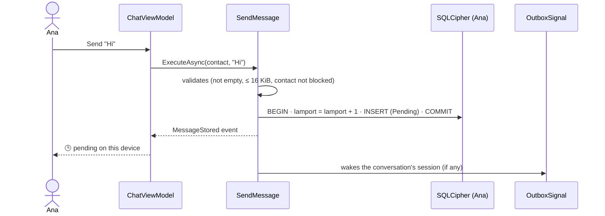
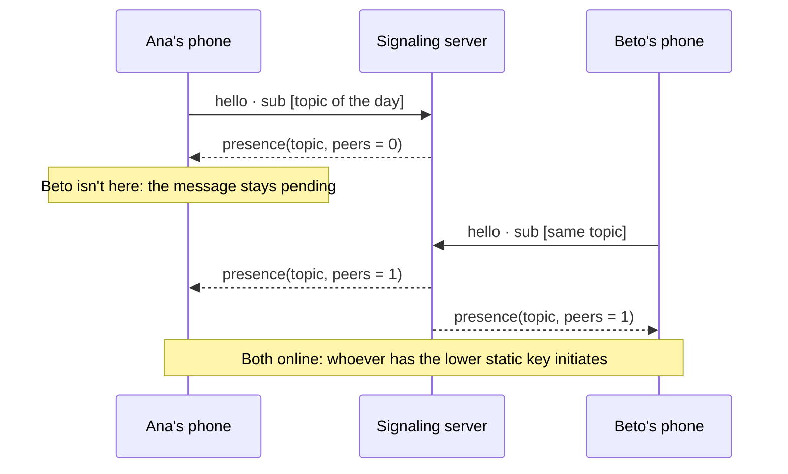
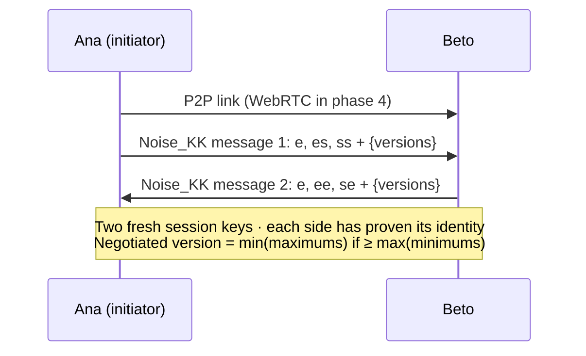
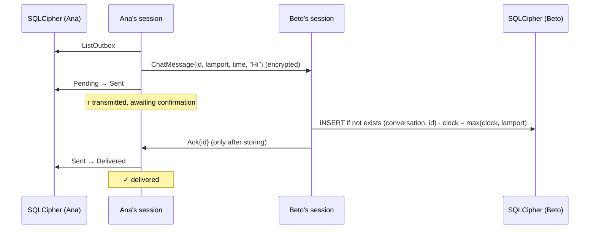
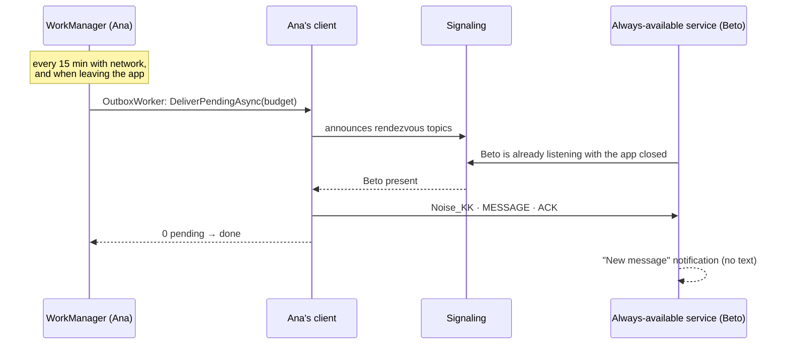
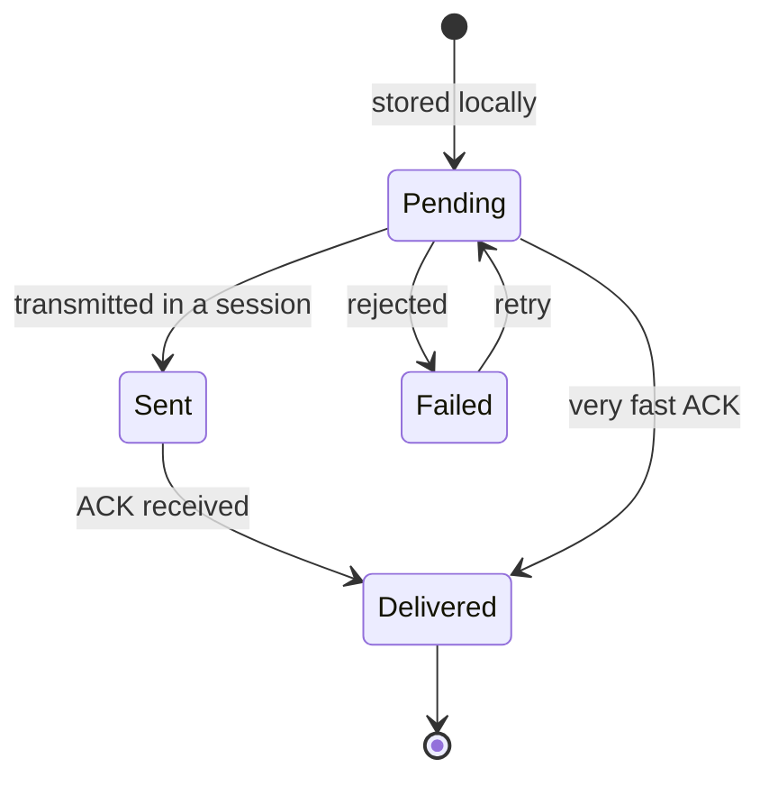

# The life of a message

Ana writes "Hi" to Beto. Here's how that message travels, step by step.

## 1. Writing: it's stored first

The message exists **before** any attempt to send it. If the app dies now, nothing is lost.

## 2. Finding each other

The topic is `HKDF(DH(staticAna, staticBeto), day)`: only the two of them can compute it.
[More on rendezvous topics](/concepts/rendezvous).

## 3. Connecting and authenticating

If someone impersonates Beto, the handshake fails: they don't have his private key.
[More on Noise](/concepts/noise).

## 4. Delivering and acknowledging

### What if something goes wrong?

| Failure | What happens |
|---|---|
| The ACK is lost | With no ACK within 10 s, Ana resends (10 s → 20 s → … → 2 min, with jitter). Beto already has it: he doesn't duplicate it and acknowledges again. |
| The network drops | The session ends; `ContactConnection` moves to *Reconnecting* and retries. Anything unacknowledged is resent in the next session. |
| Ana closes the app | The message stays in her database as *Pending* or *Sent*. It's resent when she comes back. |
| Beto receives 10,000 messages at once | Backpressure: he reads them at 20/s after a burst of 200, without dropping the session. |
| Someone tampers with a byte | ChaCha20-Poly1305 detects it, the session is closed and reconnects. |
| The phones' clocks disagree | Ordering comes from the Lamport clock, not the wall-clock time. |

## Without opening the app {#without-opening-the-app}

Android suspends apps in the background, so Murmur relies on two mechanisms
([ADR-012](/guide/decisions#adr-012)):

- **The sender** doesn't need the app open: the job starts the client, waits for ACKs until its
  time budget runs out and then stops. Anything still pending is retried on the next run.
- **The recipient** can turn on **Always available** in Settings: a foreground service with a
  persistent notification keeps the phone reachable and comes back after a reboot. Without it,
  they receive the next time they open the app.
- The server still stores nothing, and notifications never show the message text.

## 5. Statuses the user sees

🕒 pending on this device · ↑ transmitted, awaiting confirmation · ✓ delivered · ! not delivered.
The app **never** says "sent" when the message is only on your phone.
