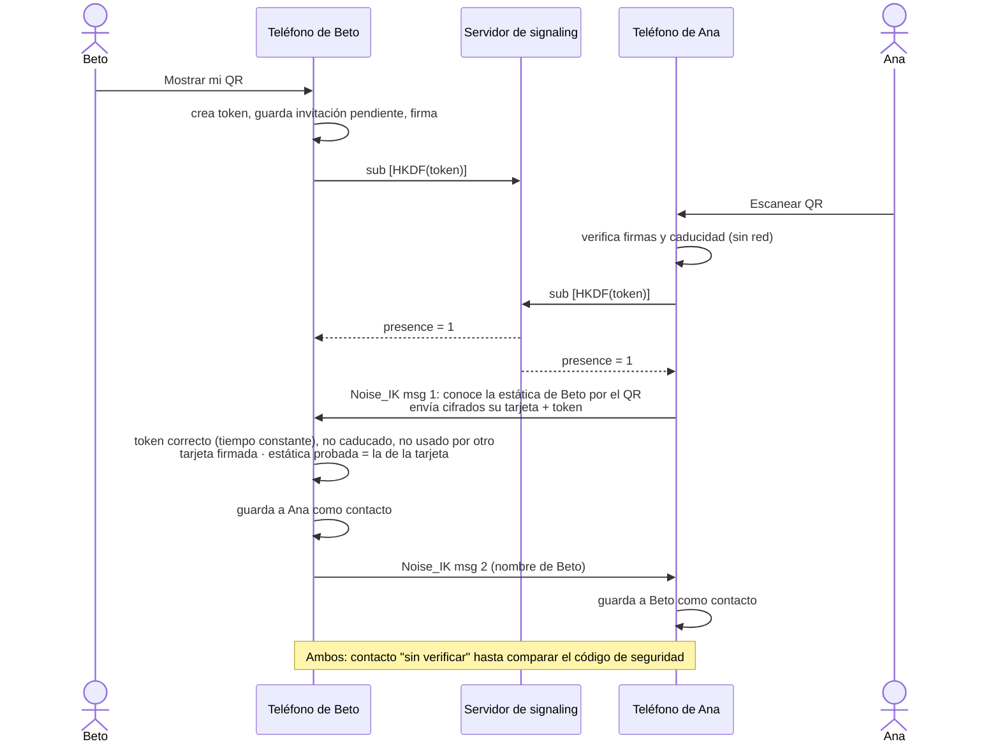

# Emparejamiento por QR

En Directo no hay directorio de usuarios: para hablar con alguien, os tenéis que **ver en persona**
(o por videollamada) y uno escanea el QR del otro.

## Qué contiene el QR

```text
DIRECTO1:<base64url( { cuerpo, firma } )>

cuerpo = { versión, tarjeta de identidad, token aleatorio (16 bytes), caducidad, nombre opcional }
tarjeta = { clave de identidad Ed25519, clave estática X25519, firma }
firma   = Ed25519(clave de identidad, "Directo/v1/invite" ‖ cuerpo)
```

Solo **claves públicas** y un token de un solo uso. Nunca claves privadas ni secretos permanentes.
Caduca a los 10 minutos.

## El flujo completo



## Por qué así

- **Verificar sin red:** la firma del QR prueba que la invitación viene de la clave de identidad
  que contiene y que nadie la modificó.
- **Noise_IK:** Ana ya conoce la clave estática de Beto, así que puede cifrar desde el primer
  mensaje. Beto conoce a Ana justo en ese mensaje, y el handshake **demuestra** que Ana posee la
  privada de la clave que dice tener.
- **Bidireccional:** Beto no responde nada si alguna comprobación falla, y cada lado guarda el
  contacto solo cuando el otro ha demostrado su identidad.
- **Idempotente:** si se pierde la respuesta, Ana puede reintentar con el mismo QR; el token queda
  ligado a su identidad, no a la de un tercero.

## El riesgo que queda: alguien que ve tu QR

Si un tercero fotografía el QR y lo usa **antes** que tu contacto, se emparejará él. Mitigaciones:
token de un solo uso, caducidad de 10 minutos, el contacto aparece como **sin verificar** y el
[código de seguridad](/concepts/safety-number) no coincidirá.

::: tip Compara el código de seguridad una vez
En la ficha del contacto, ambos veis 60 dígitos. Si coinciden, nadie se ha interpuesto.
:::
