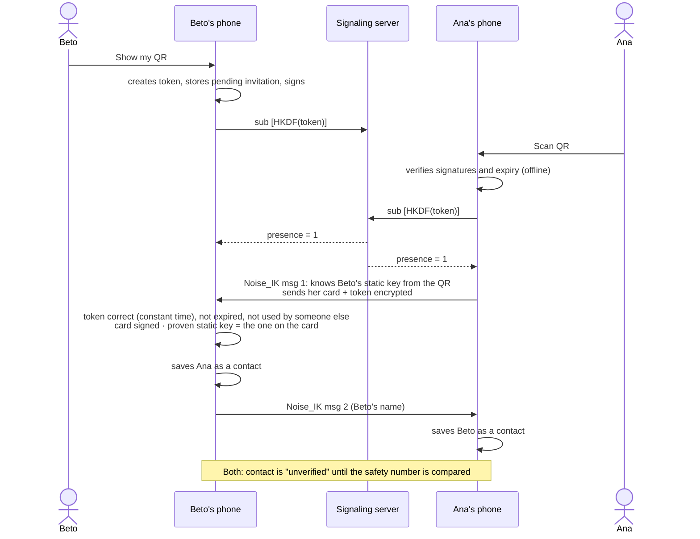

# QR pairing

Murmur has no user directory: to talk to someone, you have to **meet in person**
(or over a video call) and one of you scans the other's QR code.

## What the QR code contains

```text
MURMUR1:<base64url( { body, signature } )>

body      = { version, identity card, random token (16 bytes), expiry, optional name }
card      = { Ed25519 identity key, X25519 static key, signature }
signature = Ed25519(identity key, "Murmur/v1/invite" ‖ body)
```

Only **public keys** and a single-use token. Never private keys or long-term secrets.
It expires after 10 minutes.

## The full flow



## Why it works this way

- **Offline verification:** the QR signature proves that the invitation comes from the identity
  key it contains and that nobody has modified it.
- **Noise_IK:** Ana already knows Beto's static key, so she can encrypt from the very first
  message. Beto learns about Ana in that same message, and the handshake **proves** that Ana holds
  the private key for the key she claims to have.
- **Bidirectional:** Beto doesn't reply at all if any check fails, and each side saves the
  contact only once the other has proven its identity.
- **Idempotent:** if the reply is lost, Ana can retry with the same QR; the token becomes bound to
  her identity, not to a third party's.

## The remaining risk: someone who sees your QR

If a third party photographs the QR and uses it **before** your contact does, they will be the one
who gets paired. Mitigations: a single-use token, a 10-minute expiry, the contact shows up as
**unverified**, and the [safety number](/concepts/safety-number) won't match.

::: tip Compare the safety number once
On the contact details screen, you both see 60 digits. If they match, nobody is in the middle.
:::
