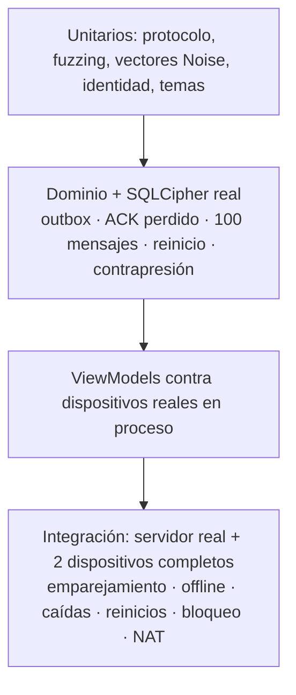

# Pruebas y CI

| Proyecto | Qué cubre |
|---|---|
| `Directo.Protocol.Tests` | Ida y vuelta de cada formato, campos desconocidos, claves duplicadas, bytes sobrantes, límites, 20 000 entradas de fuzzing, validación de temas |
| `Directo.Security.Tests` | **Vectores Noise KK e IK** de una implementación independiente, prólogos, manipulación, replay, turnos, puntos de orden bajo, invitaciones (caducidad, firma ajena, cualquier bit cambiado), código de seguridad, temas |
| `Directo.Core.Tests` | Base cifrada (sin texto plano en disco, clave incorrecta), repositorios, Lamport, idempotencia, máquina de estados, backoff, y entrega entre dos dispositivos con fallos inyectados |
| `Directo.IntegrationTests` | Servidor de signaling (límites, presencia, relay, reconexión), escenarios completos, transporte de desarrollo y ViewModels |

## Escenarios de extremo a extremo

- Emparejar por QR crea contactos mutuos con el mismo código de seguridad.
- Un mensaje espera en el emisor hasta que el receptor aparece.
- **Si el emisor está offline no se entrega nada**, aunque el receptor esté conectado.
- Una caída de red se recupera sin duplicados.
- Sin ruta directa los mensajes siguen pendientes hasta que la hay.
- Un contacto bloqueado no recibe nada.
- Reiniciar la app conserva identidad, contactos y outbox.
- **El servidor nunca ve contenido, nombres ni claves de identidad** (se graba todo su tráfico).
- Invitaciones propias, manipuladas o ya usadas se rechazan.

## CI (GitHub Actions)

| Job | Pasos |
|---|---|
| Core | `dotnet format --verify-no-changes`, build Release con avisos como errores, tests con cobertura, comprobación de dependencias vulnerables |
| Android | Workload MAUI, dependencias de Android, build Release, APK Debug descargable |
| Contenedor | Imagen Docker del servidor de signaling |
| Pages | Este sitio |
