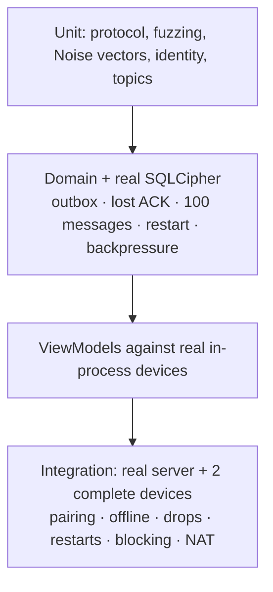

# Testing and CI

| Project | What it covers |
|---|---|
| `Murmur.Protocol.Tests` | Round trips of every format, unknown fields, duplicate keys, trailing bytes, limits, 20,000 fuzzing inputs, topic validation |
| `Murmur.Security.Tests` | **Noise KK and IK vectors** from an independent implementation, prologues, tampering, replay, turn-taking, low-order points, invites (expiry, foreign signature, any flipped bit), safety number, topics |
| `Murmur.Core.Tests` | Encrypted database (no plaintext on disk, wrong key), repositories, Lamport, idempotency, state machine, backoff, and delivery between two devices with injected faults |
| `Murmur.IntegrationTests` | Signaling server (limits, presence, relay, reconnection), full scenarios, development transport and ViewModels |

## End-to-end scenarios

- Pairing via QR creates mutual contacts with the same safety number.
- A message waits on the sender until the recipient shows up.
- **If the sender is offline nothing is delivered**, even if the recipient is connected.
- A network drop recovers without duplicates.
- Without a direct route, messages stay pending until there is one.
- A blocked contact receives nothing.
- Restarting the app keeps identity, contacts and outbox.
- **The server never sees content, names or identity keys** (all of its traffic is recorded).
- Your own, tampered or already-used invites are rejected.

## CI (GitHub Actions)

| Job | Steps |
|---|---|
| Core | `dotnet format --verify-no-changes`, Release build with warnings as errors, tests with coverage, vulnerable-dependency check |
| Android | MAUI workload, Android dependencies, Release build, downloadable Debug APK |
| Container | Docker image of the signaling server |
| Pages | This site |
