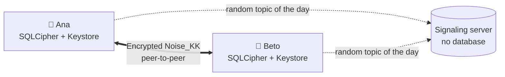

## At a glance

  
<strong>App</strong>.NET MAUI (Android first, iOS later), XAML + MVVM with CommunityToolkit.Mvvm

  
<strong>Cryptography</strong>Noise KK/IK, X25519, Ed25519, ChaCha20-Poly1305, HKDF on top of BouncyCastle

  
<strong>Storage</strong>SQLite + SQLCipher, key in the Android Keystore, versioned migrations

  
<strong>Protocol</strong>Strict CBOR between phones, JSON for signaling, public specification

  
<strong>Server</strong>ASP.NET Core + WebSockets: presence and negotiation relay, no persistence

  
<strong>Architecture</strong>Clean Architecture, dependency-free domain, ports and small interfaces

  
<strong>Testing</strong>xUnit, Noise test vectors, parser fuzzing, integration against the real server

  
<strong>License</strong>AGPL-3.0 for the code, CC BY 4.0 for the specification

## How it works, in one picture

The server only helps them **find each other**. Messages go from phone to phone, and only the two
ends can read them.

::: warning Status: pre-alpha and unaudited
Don't use Murmur for sensitive communications until an independent security audit has taken place.
See [Privacy and threats](/guide/privacy).
:::

